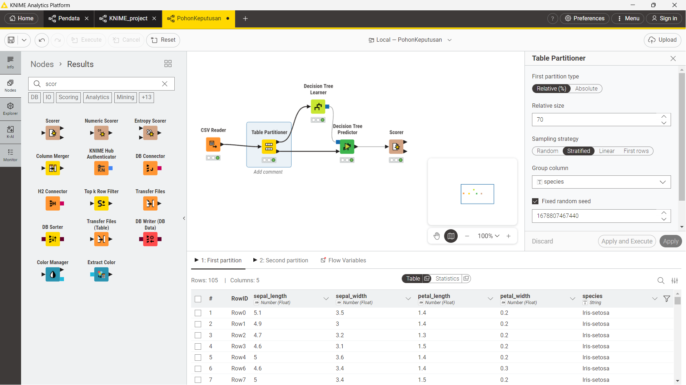
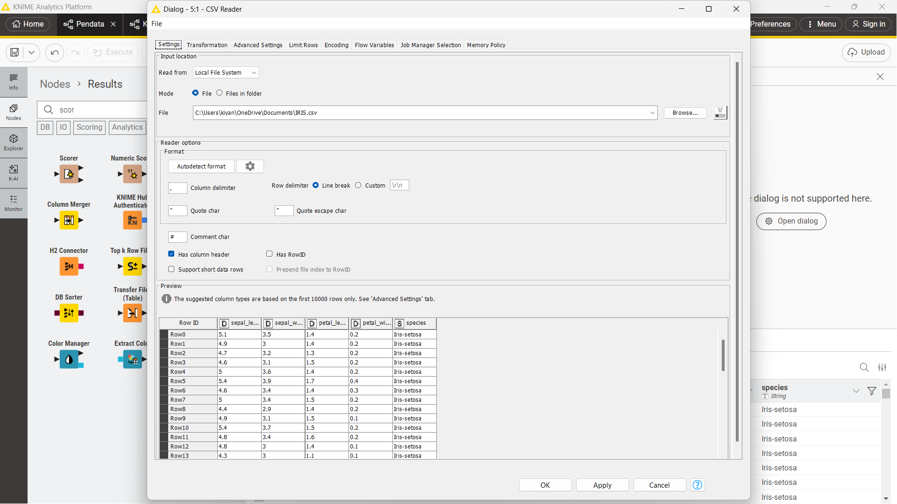
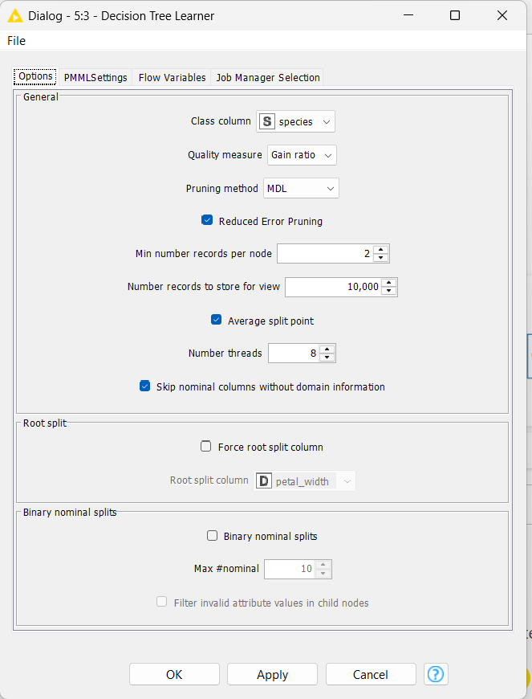
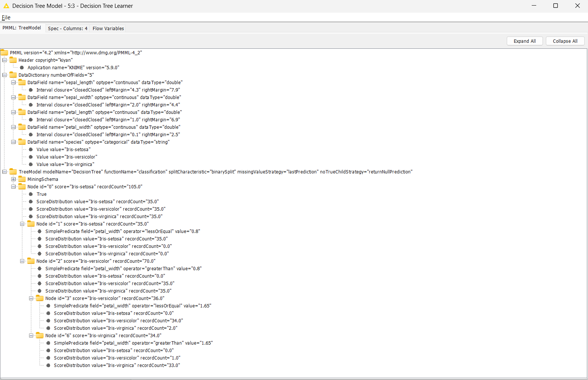
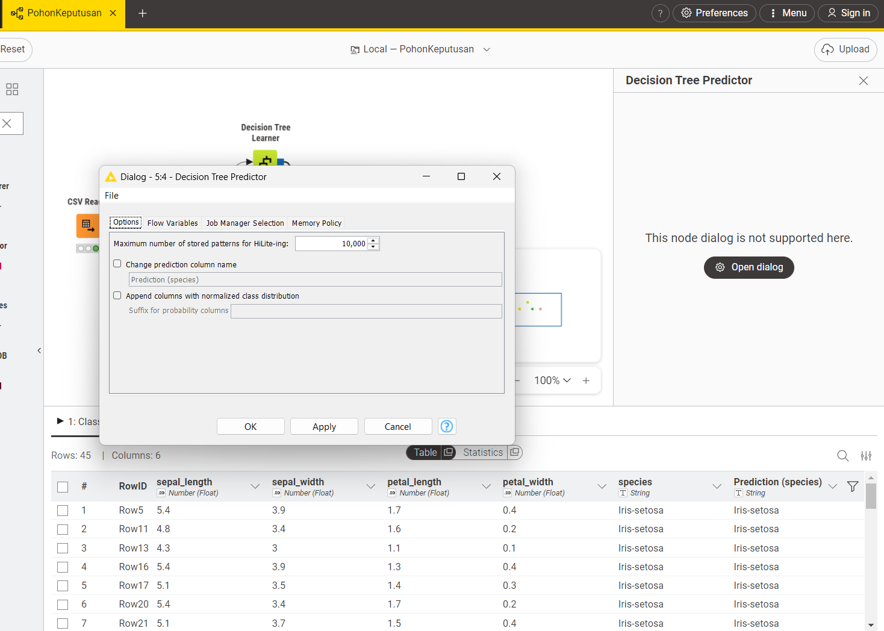
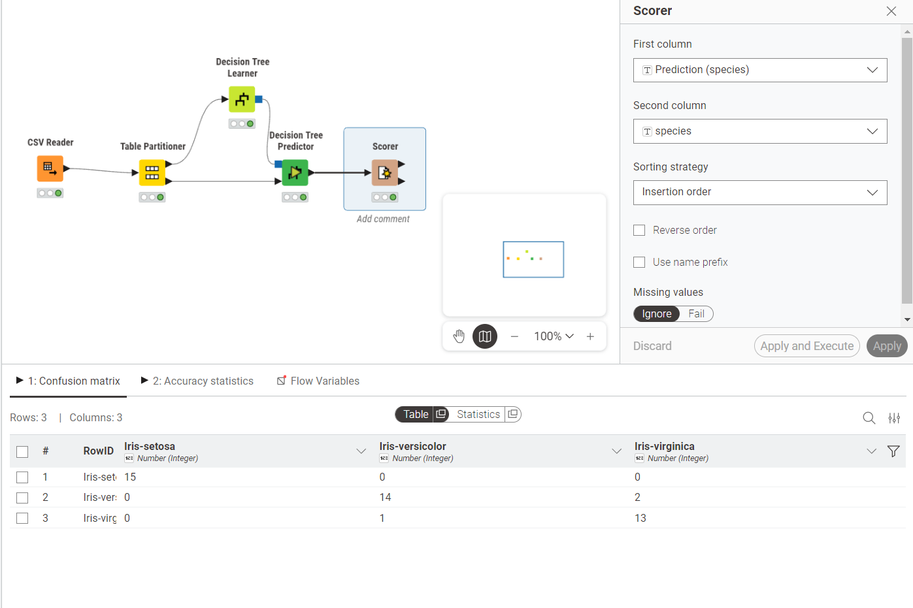

# Analisis Data Menggunakan Pohon Keputusan (Decision Tree)
**Mata Kuliah:** Penambangan Data  
**Dataset:** Iris Dataset  
**Tools:** KNIME Analytics Platform

---

## 1. Konsep Dasar Pohon Keputusan

### Apa Itu Pohon Keputusan?

Pohon Keputusan (*Decision Tree*) adalah salah satu algoritma klasifikasi yang paling populer dalam Machine Learning dan Data Mining. Algoritma ini bekerja dengan cara membagi data secara rekursif berdasarkan nilai atribut tertentu, membentuk struktur seperti pohon yang terdiri dari:

- **Root Node (Akar):** Node teratas yang mewakili seluruh dataset. Pemisahan pertama dimulai dari sini.
- **Internal Node (Simpul Internal):** Merepresentasikan sebuah pengujian (tes) pada suatu atribut/fitur.
- **Branch (Cabang):** Merepresentasikan hasil dari pengujian tersebut.
- **Leaf Node (Daun):** Node terminal yang merepresentasikan label kelas (hasil prediksi).

### Cara Kerja Algoritma

1. Mulai dari seluruh dataset di root node.
2. Pilih atribut terbaik sebagai pemisah berdasarkan suatu ukuran kualitas (misalnya Gain Ratio).
3. Bagi dataset menjadi subset berdasarkan nilai atribut tersebut.
4. Ulangi proses secara rekursif untuk setiap subset hingga kondisi berhenti terpenuhi (semua data dalam satu node memiliki kelas yang sama, atau tidak ada atribut yang tersisa).

---

## 2. Ukuran Pembangunan Pohon: Gain Ratio

### 2.1 Entropy

Sebelum memahami Gain Ratio, perlu dipahami konsep **Entropy**, yaitu ukuran ketidakmurnian (*impurity*) atau ketidakpastian dalam suatu kumpulan data.

$$H(S) = -\sum_{i=1}^{c} p_i \log_2(p_i)$$

Di mana:
- $S$ = kumpulan data
- $c$ = jumlah kelas
- $p_i$ = proporsi sampel yang termasuk kelas $i$

Nilai entropy = 0 berarti data murni (hanya satu kelas), sedangkan entropy maksimum berarti data tersebar merata di semua kelas.

### 2.2 Information Gain

**Information Gain** mengukur seberapa besar pengurangan entropy setelah data dibagi berdasarkan suatu atribut $A$:

$$IG(S, A) = H(S) - \sum_{v \in Values(A)} \frac{|S_v|}{|S|} \cdot H(S_v)$$

Di mana:
- $H(S)$ = entropy sebelum pemisahan
- $S_v$ = subset data dengan nilai atribut $A = v$
- $|S_v| / |S|$ = proporsi data pada subset $v$

**Kelemahan Information Gain:** Cenderung memilih atribut dengan jumlah nilai unik yang banyak (misalnya ID), karena pemisahan yang banyak menghasilkan entropy kecil secara artifisial.

### 2.3 Gain Ratio (yang digunakan dalam eksperimen ini)

**Gain Ratio** adalah penyempurnaan dari Information Gain yang menghukum atribut dengan banyak nilai unik, menggunakan nilai **Split Information**:

$$SplitInfo(S, A) = -\sum_{v \in Values(A)} \frac{|S_v|}{|S|} \log_2\left(\frac{|S_v|}{|S|}\right)$$

$$GainRatio(S, A) = \frac{IG(S, A)}{SplitInfo(S, A)}$$

**Keunggulan Gain Ratio:**
- Lebih adil dalam memilih atribut pemisah.
- Tidak bias terhadap atribut dengan banyak nilai.
- Digunakan dalam algoritma **C4.5** (evolusi dari ID3).

---

## 3. Dataset Iris

Dataset Iris adalah dataset klasik dalam machine learning, terdiri dari **150 baris** dan **5 kolom**:

| Kolom | Tipe | Deskripsi |
|---|---|---|
| `sepal_length` | Double | Panjang kelopak bunga (cm) |
| `sepal_width` | Double | Lebar kelopak bunga (cm) |
| `petal_length` | Double | Panjang mahkota bunga (cm) |
| `petal_width` | Double | Lebar mahkota bunga (cm) |
| `species` | String | Jenis bunga (target/label) |

**Tiga kelas target:**
- `Iris-setosa`
- `Iris-versicolor`
- `Iris-virginica`

---

## 4. Workflow KNIME

Workflow yang dibangun terdiri dari **4 node utama** yang terhubung secara berurutan:

```
CSV Reader → Table Partitioner → Decision Tree Learner → Decision Tree Predictor → Scorer
```

### Gambaran Umum Workflow

  
*Gambar 2: Tampilan keseluruhan workflow KNIME PohonKeputusan*

---

## 5. Penjelasan Setiap Node

### 5.1 Node 1: CSV Reader

Node ini digunakan untuk **membaca dataset** dari file CSV yang tersimpan di sistem lokal.

  
*Gambar 1: Konfigurasi node CSV Reader membaca file IRIS.csv*

**Konfigurasi yang digunakan:**
- **Read from:** Local File System
- **File:** `C:\Users\kiyan\OneDrive\Documents\IRIS.csv`
- **Column delimiter:** `,` (koma)
- **Row delimiter:** Line break
- **Has column header:** ✅ Dicentang (baris pertama sebagai nama kolom)
- **Has RowID:** ❌ Tidak dicentang

**Output:** Tabel dengan 150 baris dan 5 kolom (sepal_length, sepal_width, petal_length, petal_width, species).

---

### 5.2 Node 2: Table Partitioner

Node ini digunakan untuk **membagi dataset** menjadi dua bagian: data latih (*training set*) dan data uji (*test set*).

  
*Gambar 2: Konfigurasi Table Partitioner dengan stratified sampling*

**Konfigurasi yang digunakan:**
- **First partition type:** Relative (%)
- **Relative size:** **70%** → data latih (105 baris)
- **Remaining:** **30%** → data uji (45 baris)
- **Sampling strategy:** **Stratified** — memastikan proporsi setiap kelas terjaga di kedua partisi
- **Group column:** `species`
- **Fixed random seed:** 1678807467440

**Mengapa Stratified?**  
Stratified sampling memastikan setiap kelas (Iris-setosa, Iris-versicolor, Iris-virginica) terwakili secara proporsional di data latih maupun data uji, sehingga model tidak belajar dari data yang tidak seimbang.

**Output:**
- Port 1: **105 baris** → data latih (dikirim ke Decision Tree Learner)
- Port 2: **45 baris** → data uji (dikirim ke Decision Tree Predictor)

---

### 5.3 Node 3: Decision Tree Learner

Node ini adalah inti dari workflow — digunakan untuk **melatih model pohon keputusan** dari data latih.

  
*Gambar 3: Konfigurasi Decision Tree Learner*

**Konfigurasi yang digunakan:**

| Parameter | Nilai | Penjelasan |
|---|---|---|
| Class column | `species` | Kolom target yang ingin diprediksi |
| Quality measure | **Gain ratio** | Ukuran pemilihan atribut terbaik |
| Pruning method | **MDL** | Minimum Description Length — mencegah overfitting |
| Reduced Error Pruning | ✅ | Pemangkasan tambahan untuk menyederhanakan pohon |
| Min number records per node | 2 | Minimal 2 data untuk membuat split baru |
| Average split point | ✅ | Menggunakan rata-rata sebagai titik pemisah numerik |

**Mengapa MDL Pruning?**  
Pruning (pemangkasan) bertujuan mengurangi kompleksitas pohon agar tidak *overfit* terhadap data latih. MDL memangkas cabang yang tidak memberikan gain informasi yang signifikan.

**Output Model (PMML - Gambar 4):**

  
*Gambar 4: Struktur model pohon keputusan dalam format PMML*

Dari output PMML terlihat struktur pohon yang dibangun:

```
Root (105 records)
├── IF petal_width ≤ 0.8 → Iris-setosa (35 records) ✅
└── IF petal_width > 0.8 (70 records)
    ├── IF petal_width ≤ 1.65 → Iris-versicolor (36 records)
    │   ├── [34 versicolor, 2 virginica]
    └── IF petal_width > 1.65 → Iris-virginica (34 records)
        ├── [1 versicolor, 33 virginica]
```

**Insight:** Atribut `petal_width` (lebar mahkota) menjadi fitur paling penting dan dipilih sebagai root split, karena memiliki Gain Ratio tertinggi.

---

### 5.4 Node 4: Decision Tree Predictor

Node ini digunakan untuk **menerapkan model** yang sudah dilatih ke data uji (45 baris dari Table Partitioner port 2).

  
*Gambar 5: Konfigurasi Decision Tree Predictor dan hasil prediksi*

**Konfigurasi yang digunakan:**
- **Change prediction column name:** ❌ (menggunakan nama default)
- **Prediction column name:** `Prediction (species)`
- **Append columns with normalized class distribution:** ❌

**Output:** Tabel 45 baris dengan kolom tambahan `Prediction (species)` yang berisi hasil prediksi model.

Contoh hasil prediksi (beberapa baris pertama):

| RowID | sepal_length | sepal_width | petal_length | petal_width | species | Prediction (species) |
|---|---|---|---|---|---|---|
| Row5 | 5.4 | 3.9 | 1.7 | 0.4 | Iris-setosa | Iris-setosa ✅ |
| Row11 | 4.8 | 3.4 | 1.6 | 0.2 | Iris-setosa | Iris-setosa ✅ |
| Row13 | 4.3 | 3.0 | 1.1 | 0.1 | Iris-setosa | Iris-setosa ✅ |

---

### 5.5 Node 5: Scorer

Node ini digunakan untuk **mengevaluasi performa model** dengan membandingkan nilai aktual (`species`) dengan hasil prediksi (`Prediction (species)`).

  
*Gambar 6: Konfigurasi Scorer dan confusion matrix hasil evaluasi*

**Konfigurasi yang digunakan:**
- **First column:** `Prediction (species)`
- **Second column:** `species`
- **Sorting strategy:** Insertion order

#### Confusion Matrix

|  | Iris-setosa | Iris-versicolor | Iris-virginica |
|---|---|---|---|
| **Iris-setosa** | **15** | 0 | 0 |
| **Iris-versicolor** | 0 | **14** | 2 |
| **Iris-virginica** | 0 | 1 | **13** |

#### Analisis Hasil

| Metrik | Nilai |
|---|---|
| Total data uji | 45 |
| Prediksi benar | 15 + 14 + 13 = **42** |
| Prediksi salah | 2 + 1 = **3** |
| **Akurasi** | **42/45 = 93.33%** |

**Interpretasi:**
- **Iris-setosa** diklasifikasikan sempurna — 15/15 benar (100%).
- **Iris-versicolor** — 2 data salah diprediksi sebagai Iris-virginica.
- **Iris-virginica** — 1 data salah diprediksi sebagai Iris-versicolor.
- Kesalahan klasifikasi hanya terjadi antara *versicolor* dan *virginica*, karena kedua spesies ini memiliki nilai `petal_width` yang tumpang tindih di sekitar nilai threshold 1.65.

---

## 6. Kesimpulan

Model Pohon Keputusan yang dibangun dengan KNIME menggunakan dataset Iris berhasil mencapai **akurasi 93.33%** pada data uji (45 data). Beberapa poin penting:

1. **Gain Ratio** terbukti efektif dalam memilih atribut pemisah yang tidak bias, menghasilkan pohon yang sederhana namun akurat.
2. **Fitur `petal_width`** adalah fitur paling diskriminatif untuk membedakan ketiga spesies bunga Iris.
3. **Stratified sampling** memastikan evaluasi model yang adil dan representatif.
4. **Pruning MDL** berhasil menghasilkan pohon yang tidak terlalu kompleks, sehingga menghindari overfitting.

---

## 7. Referensi

- Quinlan, J.R. (1993). *C4.5: Programs for Machine Learning*. Morgan Kaufmann.
- Han, J., Kamber, M., & Pei, J. (2011). *Data Mining: Concepts and Techniques* (3rd ed.). Morgan Kaufmann.
- KNIME Documentation: [https://docs.knime.com](https://docs.knime.com)
- UCI Machine Learning Repository — Iris Dataset: [https://archive.ics.uci.edu/ml/datasets/iris](https://archive.ics.uci.edu/ml/datasets/iris)