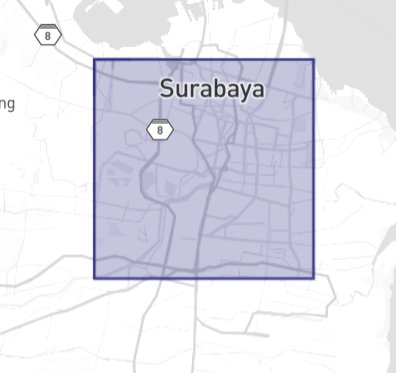
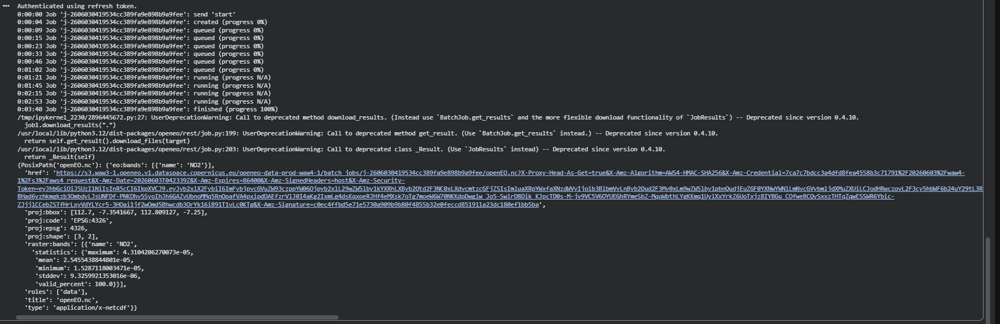
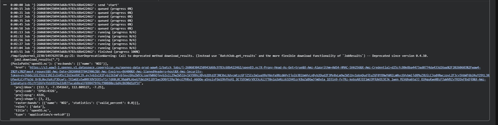
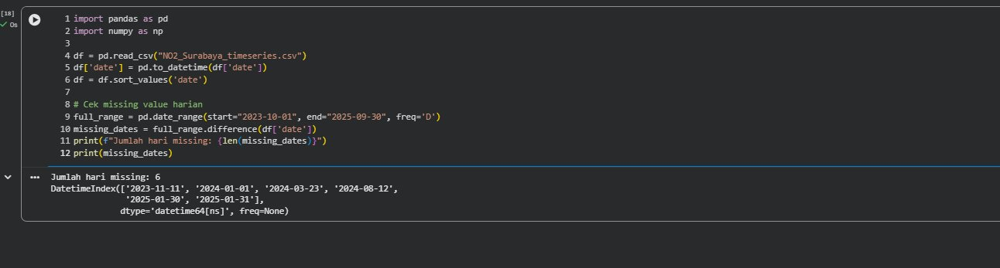
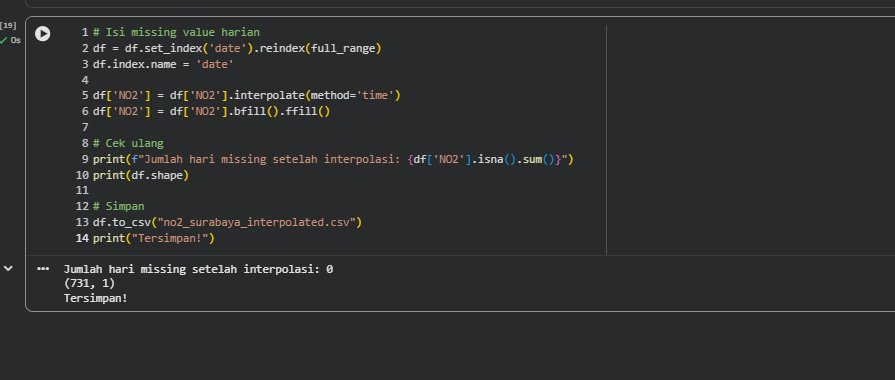
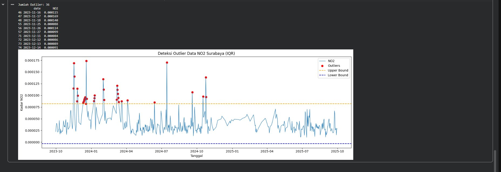
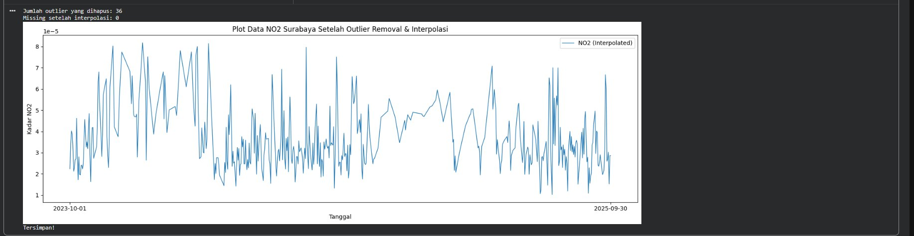
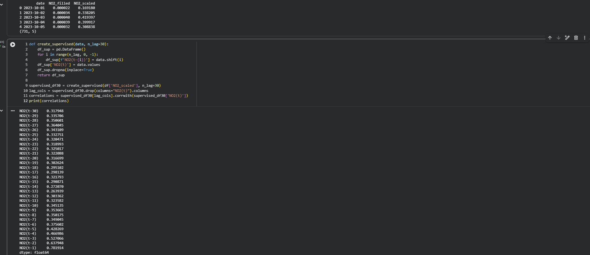
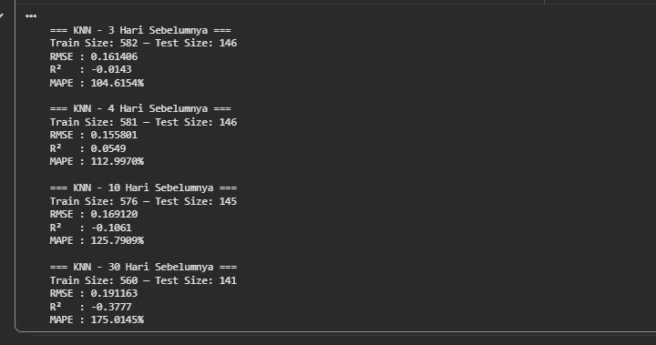
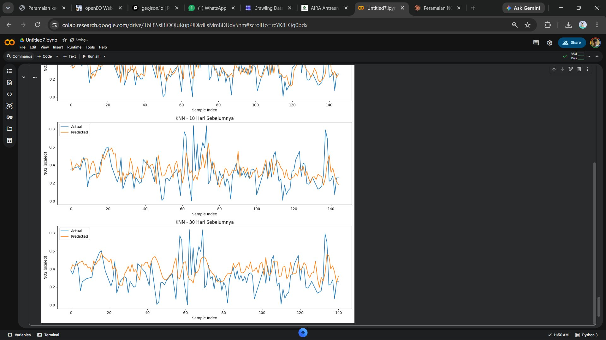

# Peramalan Kadar NO₂ di Daerah Surabaya

## Latar Belakang

Peningkatan aktivitas industri, transportasi, serta pertumbuhan populasi yang pesat telah menyebabkan peningkatan signifikan terhadap tingkat pencemaran udara di berbagai wilayah. Salah satu polutan udara utama yang menjadi perhatian adalah Nitrogen Dioksida (NO₂), yaitu gas beracun yang dihasilkan terutama dari proses pembakaran bahan bakar fosil seperti kendaraan bermotor, pembangkit listrik, dan kegiatan industri.

Surabaya sebagai kota terbesar kedua di Indonesia memiliki tingkat kepadatan lalu lintas dan aktivitas industri yang sangat tinggi, sehingga pemantauan dan peramalan kadar NO₂ menjadi sangat penting untuk mendukung kebijakan pengendalian kualitas udara.

---

## 1. Pengumpulan Data

Data Time Series harian kadar NO₂ di daerah Surabaya diambil dari satelit Sentinel-5P melalui platform Copernicus Data Space di https://dataspace.copernicus.eu/.

### a. Install Library

```python
!pip install openeo netCDF4
```

### b. Koneksi dan Autentikasi

```python
import openeo

connection = openeo.connect("openeo.dataspace.copernicus.eu").authenticate_oidc()
```

Klik link autentikasi yang muncul di output, lalu login dengan akun Copernicus.

### c. Menentukan Koordinat Area Surabaya

Koordinat bounding box Surabaya diambil menggunakan https://geojson.io. Pilih area dengan fitur kotak lalu salin koordinat dari panel JSON sebelah kanan.



JSON yang dihasilkan dari geojson.io:

```json
{
  "type": "FeatureCollection",
  "features": [
    {
      "type": "Feature",
      "geometry": {
        "type": "Polygon",
        "coordinates": [
          [
            [112.67240232546169, -7.230409030371035],
            [112.79409968570803, -7.230401136453622],
            [112.79410096804787, -7.351123833862189],
            [112.67241352345985, -7.351112431553361],
            [112.67240232546169, -7.230409030371035]
          ]
        ]
      }
    }
  ]
}
```

### d. Pengambilan Data — Job 1 (2023–2024)

Karena rentang data 2 tahun cukup besar, pengambilan data dipecah menjadi 2 job agar tidak error.

```python
import openeo

connection = openeo.connect("openeo.dataspace.copernicus.eu").authenticate_oidc()

s5post_1 = connection.load_collection(
    "SENTINEL_5P_L2",
    temporal_extent=["2023-10-01", "2024-10-01"],
    spatial_extent={
        "west":  112.70,
        "south": -7.32,
        "east":  112.78,
        "north": -7.25
    },
    bands=["NO2"],
)

s5p_daily_1 = s5post_1.aggregate_temporal_period(reducer="mean", period="day")

job1 = s5p_daily_1.execute_batch(
    title="NO2 Surabaya 2023-2024",
    outputfile="NO2Surabaya_2023_2024.nc",
    max_poll_interval=60,
    require_success=False
)
job1.download_results(".")
```

Output ketika Job 1 berhasil:



### e. Pengambilan Data — Job 2 (2024–2025)

Jalankan setelah Job 1 selesai.

```python
s5post_2 = connection.load_collection(
    "SENTINEL_5P_L2",
    temporal_extent=["2024-10-01", "2025-10-01"],
    spatial_extent={
        "west":  112.70,
        "south": -7.32,
        "east":  112.78,
        "north": -7.25
    },
    bands=["NO2"],
)

s5p_daily_2 = s5post_2.aggregate_temporal_period(reducer="mean", period="day")

job2 = s5p_daily_2.execute_batch(
    title="NO2 Surabaya 2024-2025",
    outputfile="NO2Surabaya_2024_2025.nc",
    max_poll_interval=60,
    require_success=False
)
job2.download_results(".")
```

Output ketika Job 2 berhasil:



---

## 2. Preprocessing Data

### a. Gabungkan 2 File NC

```python
import netCDF4
import numpy as np
import pandas as pd

def read_nc(file_path):
    ds = netCDF4.Dataset(file_path)
    no2 = ds.variables["NO2"][:]
    time = ds.variables["t"][:]
    time_units = ds.variables["t"].units
    dates = netCDF4.num2date(time, units=time_units)
    return no2, dates

no2_1, dates_1 = read_nc("NO2Surabaya_2023_2024.nc")
no2_2, dates_2 = read_nc("NO2Surabaya_2024_2025.nc")

no2_all   = np.ma.concatenate([no2_1, no2_2], axis=0)
dates_all = list(dates_1) + list(dates_2)

print(f"Total record: {len(dates_all)}")
print(f"Shape NO2: {no2_all.shape}")
```

```
Total record: 725
Shape NO2: (725, 3, 2)
```

### b. Interpolasi Linear Missing Value per Grid

```python
no2_filled = np.ma.filled(no2_all.astype(float), np.nan)

for i in range(no2_filled.shape[1]):
    for j in range(no2_filled.shape[2]):
        series = pd.Series(no2_filled[:, i, j])
        no2_filled[:, i, j] = series.interpolate(
            method='linear', limit_direction='both'
        ).to_numpy()
```

### c. Rata-ratakan Spasial dan Simpan ke CSV

```python
new_dates = []
new_no2   = []

for i in range(len(dates_all)):
    new_dates.append(dates_all[i].strftime('%Y-%m-%d'))
    new_no2.append(np.mean(no2_filled[i]))

df = pd.DataFrame({"date": new_dates, "NO2": new_no2})
df.to_csv("NO2_Surabaya_timeseries.csv", index=False)
print(df.head())
print(df.shape)
```

```
         date       NO2
0  2023-10-01  0.000022
1  2023-10-02  0.000034
2  2023-10-03  0.000040
3  2023-10-04  0.000039
4  2023-10-05  0.000032
(725, 2)
```

### d. Pengecekan Missing Value Harian

```python
import pandas as pd
import numpy as np

df = pd.read_csv("NO2_Surabaya_timeseries.csv")
df['date'] = pd.to_datetime(df['date'])
df = df.sort_values('date')

full_range = pd.date_range(start="2023-10-01", end="2025-09-30", freq='D')
missing_dates = full_range.difference(df['date'])

print(f"Jumlah hari missing: {len(missing_dates)}")
print(missing_dates)
```



Ditemukan **6 hari missing** pada data harian.

### e. Interpolasi Missing Value Harian

```python
df = df.set_index('date').reindex(full_range)
df.index.name = 'date'

df['NO2'] = df['NO2'].interpolate(method='time')
df['NO2'] = df['NO2'].bfill().ffill()

print(f"Jumlah hari missing setelah interpolasi: {df['NO2'].isna().sum()}")
print(df.shape)

df.to_csv("no2_surabaya_interpolated.csv")
print("Tersimpan!")
```



Setelah interpolasi, jumlah hari missing menjadi **0** dengan total **731 baris** data.

### f. Deteksi Outlier Menggunakan Metode IQR

```python
import matplotlib.pyplot as plt

df = pd.read_csv("no2_surabaya_interpolated.csv")
df['date'] = pd.to_datetime(df['date'])

Q1 = df['NO2'].quantile(0.25)
Q3 = df['NO2'].quantile(0.75)
IQR = Q3 - Q1
lower_bound = Q1 - 1.5 * IQR
upper_bound = Q3 + 1.5 * IQR

outliers_iqr = df[(df['NO2'] < lower_bound) | (df['NO2'] > upper_bound)]
print(f"Jumlah Outlier: {len(outliers_iqr)}")
print(outliers_iqr[['date', 'NO2']].head(10))

plt.figure(figsize=(15,5))
plt.plot(df['date'], df['NO2'], label="NO2", linewidth=1)
plt.scatter(outliers_iqr['date'], outliers_iqr['NO2'], color='red', label="Outliers")
plt.axhline(upper_bound, color='orange', linestyle='dashed', label="Upper Bound")
plt.axhline(lower_bound, color='blue',   linestyle='dashed', label="Lower Bound")
plt.title("Deteksi Outlier Data NO2 Surabaya (IQR)")
plt.xlabel("Tanggal")
plt.ylabel("Kadar NO2")
plt.legend()
plt.tight_layout()
plt.show()
```



Ditemukan **36 outlier** pada data NO₂ Surabaya — lebih banyak dibanding Bangkalan (14 outlier) karena aktivitas kota Surabaya yang lebih padat dan fluktuatif.

### g. Hapus Outlier dan Interpolasi Kembali

```python
df['NO2_cleaned'] = df['NO2'].mask(
    (df['NO2'] < lower_bound) | (df['NO2'] > upper_bound)
)

print(f"Jumlah outlier yang dihapus: {df['NO2_cleaned'].isna().sum()}")

df['NO2_filled'] = df['NO2_cleaned'].interpolate(method='linear')
df['NO2_filled'] = df['NO2_filled'].bfill().ffill()

print(f"Missing setelah interpolasi: {df['NO2_filled'].isna().sum()}")

plt.figure(figsize=(15,5))
plt.plot(df['date'], df['NO2_filled'], label="NO2 (Interpolated)", linewidth=1)
plt.xticks(
    ticks=[df['date'].iloc[0], df['date'].iloc[-1]],
    labels=[df['date'].iloc[0].strftime('%Y-%m-%d'),
            df['date'].iloc[-1].strftime('%Y-%m-%d')]
)
plt.title("Plot Data NO2 Surabaya Setelah Outlier Removal & Interpolasi")
plt.xlabel("Tanggal")
plt.ylabel("Kadar NO2")
plt.legend()
plt.tight_layout()
plt.show()

df.to_csv("no2_surabaya_clean.csv", index=False)
print("Tersimpan!")
```



---

## 3. Modeling Menggunakan KNN Regression

### a. Normalisasi Data

Karena KNN Regression sensitif terhadap skala data, normalisasi menggunakan Min-Max Scaler diperlukan.

```python
from sklearn.preprocessing import MinMaxScaler

df = pd.read_csv("no2_surabaya_clean.csv")
df['date'] = pd.to_datetime(df['date'])

scaler = MinMaxScaler()
df['NO2_scaled'] = scaler.fit_transform(df[['NO2_filled']])

print(df[['date', 'NO2_filled', 'NO2_scaled']].head())
print(df.shape)
```

### b. Uji Korelasi Lag

Sebelum modeling, dilakukan uji korelasi untuk mengetahui berapa hari sebelumnya yang paling berpengaruh terhadap nilai hari ini.

```python
def create_supervised(data, n_lag=30):
    df_sup = pd.DataFrame()
    for i in range(n_lag, 0, -1):
        df_sup[f'NO2(t-{i})'] = data.shift(i)
    df_sup['NO2(t)'] = data.values
    df_sup.dropna(inplace=True)
    return df_sup

supervised_df30 = create_supervised(df['NO2_scaled'], n_lag=30)
lag_cols = supervised_df30.drop(columns="NO2(t)").columns
correlations = supervised_df30[lag_cols].corrwith(supervised_df30['NO2(t)'])
print(correlations)
```



Hasil uji korelasi menunjukkan fitur dengan nilai korelasi **> 0.5** adalah:

| Fitur | Nilai Korelasi |
|-------|----------------|
| t-1   | 0.781914 ✅    |
| t-2   | 0.637948 ✅    |
| t-3   | 0.527066 ✅    |
| t-4   | 0.466986 ❌    |

Berbeda dengan Bangkalan yang menggunakan lag 1–4, untuk Surabaya hanya **t-1 sampai t-3** yang memiliki korelasi di atas 0.5.

### c. Training dan Evaluasi Model

Untuk perbandingan, model dilatih menggunakan 3, 4, 10, dan 30 hari sebelumnya.

```python
from sklearn.neighbors import KNeighborsRegressor
from sklearn.model_selection import train_test_split
from sklearn.metrics import mean_squared_error, r2_score
import numpy as np

def MAPE(y_true, y_pred):
    y_true, y_pred = np.array(y_true), np.array(y_pred)
    nonzero = y_true != 0
    return np.mean(np.abs((y_true[nonzero] - y_pred[nonzero]) / y_true[nonzero])) * 100

def train_knn(df_supervised, model_name=""):
    X = df_supervised.drop(columns=['NO2(t)']).values
    y = df_supervised['NO2(t)'].values
    X_train, X_test, y_train, y_test = train_test_split(
        X, y, test_size=0.2, shuffle=False
    )
    knn = KNeighborsRegressor(n_neighbors=5)
    knn.fit(X_train, y_train)
    y_pred = knn.predict(X_test)

    print(f"\n=== {model_name} ===")
    print(f"Train Size: {len(X_train)} — Test Size: {len(X_test)}")
    print(f"RMSE : {np.sqrt(mean_squared_error(y_test, y_pred)):.6f}")
    print(f"R²   : {r2_score(y_test, y_pred):.4f}")
    print(f"MAPE : {MAPE(y_test, y_pred):.4f}%")

    return knn, y_test, y_pred

supervised_df3  = create_supervised(df['NO2_scaled'], n_lag=3)
supervised_df4  = create_supervised(df['NO2_scaled'], n_lag=4)
supervised_df10 = create_supervised(df['NO2_scaled'], n_lag=10)
supervised_df30 = create_supervised(df['NO2_scaled'], n_lag=30)

knn_3,  y_test_3,  y_pred_3  = train_knn(supervised_df3,  "KNN - 3 Hari Sebelumnya")
knn_4,  y_test_4,  y_pred_4  = train_knn(supervised_df4,  "KNN - 4 Hari Sebelumnya")
knn_10, y_test_10, y_pred_10 = train_knn(supervised_df10, "KNN - 10 Hari Sebelumnya")
knn_30, y_test_30, y_pred_30 = train_knn(supervised_df30, "KNN - 30 Hari Sebelumnya")
```



### d. Visualisasi Hasil Prediksi

```python
import matplotlib.pyplot as plt

fig, axes = plt.subplots(4, 1, figsize=(12, 16))

data_plot = [
    (y_test_3,  y_pred_3,  "KNN - 3 Hari Sebelumnya"),
    (y_test_4,  y_pred_4,  "KNN - 4 Hari Sebelumnya"),
    (y_test_10, y_pred_10, "KNN - 10 Hari Sebelumnya"),
    (y_test_30, y_pred_30, "KNN - 30 Hari Sebelumnya"),
]

for ax, (y_test, y_pred, label) in zip(axes, data_plot):
    ax.plot(y_test,  label="Actual")
    ax.plot(y_pred,  label="Predicted")
    ax.set_title(label)
    ax.set_xlabel("Sample Index")
    ax.set_ylabel("NO2 (scaled)")
    ax.legend()

plt.tight_layout()
plt.show()
```



---

## 4. Kesimpulan

Berikut ringkasan hasil evaluasi model KNN Regression untuk data NO₂ Surabaya:

| Model             | RMSE     | R²      | MAPE     |
|-------------------|----------|---------|----------|
| 3 Hari Sebelumnya | 0.161406 | -0.0143 | 104.61%  |
| 4 Hari Sebelumnya | 0.155801 |  0.0549 | 112.99%  |
| 10 Hari Sebelumnya| 0.169120 | -0.1061 | 125.79%  |
| 30 Hari Sebelumnya| 0.191163 | -0.3777 | 175.01%  |

Berdasarkan hasil evaluasi di atas dapat disimpulkan:

1. **Model terbaik adalah 4 hari sebelumnya** dengan RMSE terkecil (0.155801) dan R² satu-satunya yang bernilai positif (0.0549), meskipun nilainya masih sangat rendah.

2. **Semakin banyak lag justru memperburuk model** — RMSE dan MAPE terus meningkat, sedangkan R² semakin negatif pada lag 10 dan 30, yang mengindikasikan overfitting.

3. **Nilai MAPE sangat tinggi (>100%)** pada seluruh model menunjukkan bahwa data NO₂ Surabaya sangat fluktuatif dan sulit diprediksi menggunakan KNN Regression.

4. Hasil ini berbeda dengan data Bangkalan yang MAPE-nya sekitar 61–72%, menunjukkan bahwa **polusi NO₂ Surabaya jauh lebih tidak beraturan** akibat kepadatan aktivitas kota yang lebih tinggi.

5. Uji korelasi menunjukkan hanya **t-1 sampai t-3** yang memiliki korelasi di atas 0.5, lebih sedikit dari Bangkalan (t-1 sampai t-4), yang mengindikasikan pola NO₂ Surabaya lebih acak dan kurang bergantung pada hari-hari sebelumnya.

6. Diperlukan model yang lebih kompleks seperti **LSTM, GRU, atau SARIMA** untuk menangkap pola time series NO₂ di kota besar seperti Surabaya dengan lebih baik.