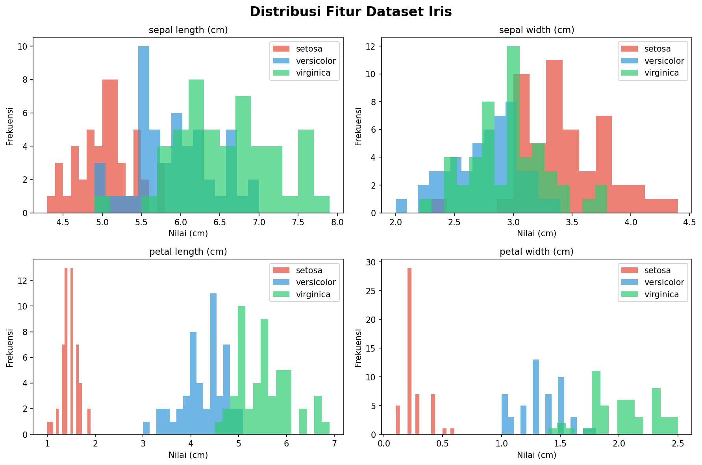
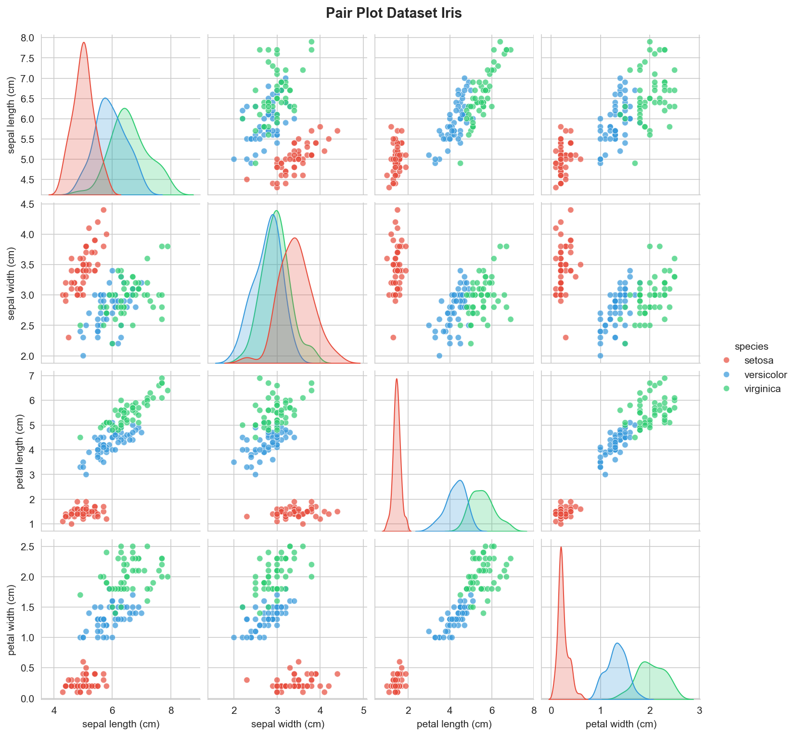
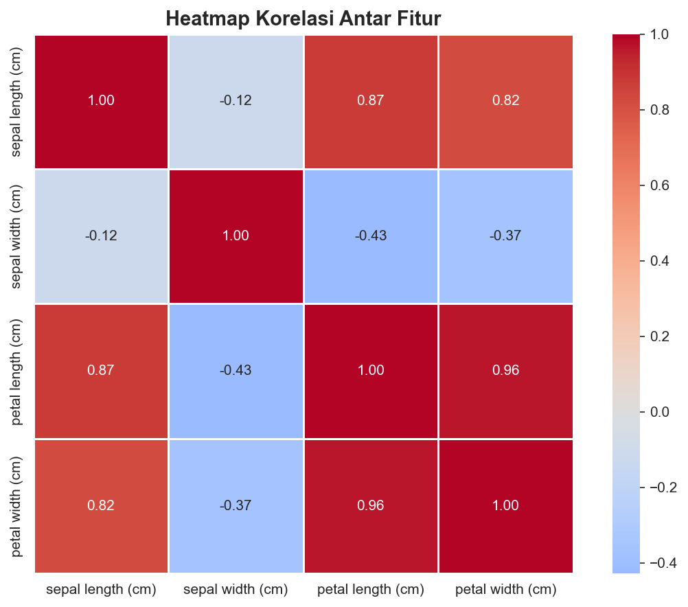
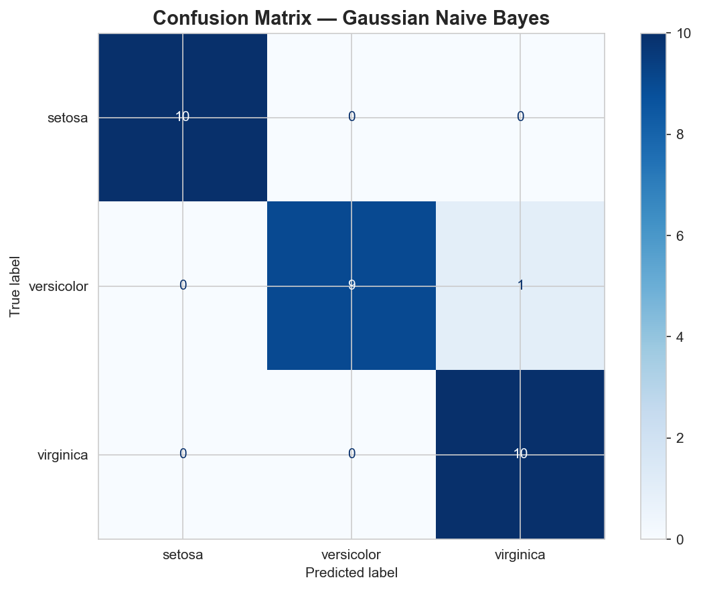
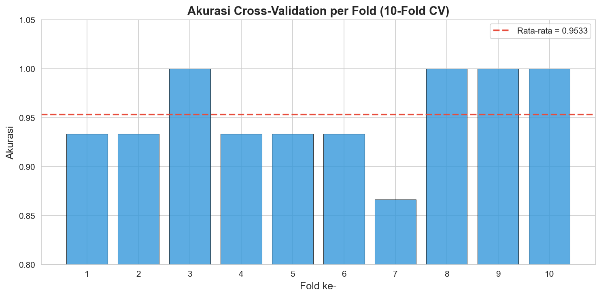
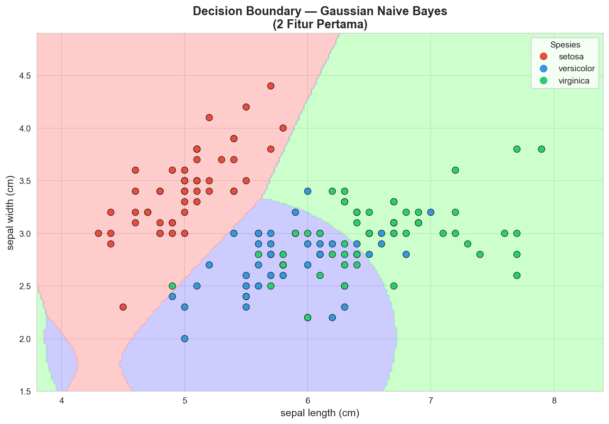

# Analisis Data Menggunakan Naive Bayes
## Penambangan Data - Teknik Informatika Semester 4

---

## 1. Pendahuluan

Naive Bayes adalah algoritma klasifikasi berbasis probabilitas yang menerapkan **Teorema Bayes** dengan asumsi bahwa setiap fitur bersifat **independen satu sama lain** (naive assumption). Meskipun asumsi ini jarang benar di dunia nyata, Naive Bayes tetap bekerja dengan sangat baik dalam banyak kasus nyata.

**Formula Teorema Bayes:**

$$P(C|X) = \frac{P(X|C) \cdot P(C)}{P(X)}$$

Keterangan:
- $P(C|X)$ = Probabilitas kelas $C$ diberikan fitur $X$ (*posterior*)
- $P(X|C)$ = Probabilitas fitur $X$ diberikan kelas $C$ (*likelihood*)
- $P(C)$ = Probabilitas awal kelas $C$ (*prior*)
- $P(X)$ = Probabilitas fitur $X$ (*evidence*)

**Dataset yang digunakan:** Iris Dataset  
**Library:** Scikit-learn (`sklearn.naive_bayes`)  
**Referensi:** https://scikit-learn.org/stable/api/sklearn.naive_bayes.html

---

## 2. Import Library

```python
import numpy as np
import pandas as pd
import matplotlib.pyplot as plt
import seaborn as sns

from sklearn.datasets import load_iris
from sklearn.model_selection import train_test_split, cross_val_score
from sklearn.naive_bayes import GaussianNB
from sklearn.metrics import (
    accuracy_score,
    classification_report,
    confusion_matrix,
    ConfusionMatrixDisplay
)

import warnings
warnings.filterwarnings('ignore')

print("Semua library berhasil diimport!")
```

---

## 3. Load dan Eksplorasi Dataset

### 3.1 Load Dataset Iris

```python
iris = load_iris()

df = pd.DataFrame(data=iris.data, columns=iris.feature_names)
df['target'] = iris.target
df['species'] = df['target'].map({0: 'setosa', 1: 'versicolor', 2: 'virginica'})

print("=" * 50)
print("INFORMASI DATASET IRIS")
print("=" * 50)
print(f"Jumlah data    : {df.shape[0]} baris")
print(f"Jumlah fitur   : {len(iris.feature_names)} kolom")
print(f"Kelas target   : {list(iris.target_names)}")
print(f"Jumlah kelas   : {len(iris.target_names)}")
df.head()
```

### 3.2 Statistik Deskriptif

```python
df.describe().round(2)
```

### 3.3 Distribusi Kelas

```python
print(df['species'].value_counts())
```

---

## 4. Visualisasi Data

### 4.1 Distribusi Setiap Fitur

```python
fig, axes = plt.subplots(2, 2, figsize=(12, 8))
fig.suptitle('Distribusi Fitur Dataset Iris', fontsize=16, fontweight='bold')

colors = ['#E74C3C', '#3498DB', '#2ECC71']
features = iris.feature_names

for idx, (ax, feature) in enumerate(zip(axes.flatten(), features)):
    for i, (species, color) in enumerate(zip(iris.target_names, colors)):
        data = df[df['target'] == i][feature]
        ax.hist(data, alpha=0.7, label=species, color=color, bins=15)
    ax.set_title(feature, fontsize=11)
    ax.set_xlabel('Nilai (cm)')
    ax.set_ylabel('Frekuensi')
    ax.legend()

plt.tight_layout()
plt.savefig('distribusi_fitur.png', dpi=150, bbox_inches='tight')
plt.show()
```

**Output:**



> Grafik di atas menunjukkan distribusi nilai dari keempat fitur untuk masing-masing spesies. Fitur **petal length** dan **petal width** memiliki pemisahan yang sangat jelas antar kelas, terutama untuk spesies *setosa* (merah) yang terpisah sempurna dari dua kelas lainnya.

---

### 4.2 Pair Plot

```python
sns.set_style("whitegrid")
pair_plot = sns.pairplot(
    df[iris.feature_names + ['species']],
    hue='species',
    palette={'setosa': '#E74C3C', 'versicolor': '#3498DB', 'virginica': '#2ECC71'},
    plot_kws={'alpha': 0.7},
    diag_kind='kde'
)
pair_plot.fig.suptitle('Pair Plot Dataset Iris', y=1.02, fontsize=14, fontweight='bold')
plt.savefig('pairplot_iris.png', dpi=150, bbox_inches='tight')
plt.show()
```

**Output:**



> Pair plot memperlihatkan hubungan antar setiap pasang fitur. Diagonal menampilkan distribusi KDE per kelas. Kombinasi **petal length vs petal width** memberikan pemisahan terbaik antar ketiga spesies. Setosa (merah) selalu terkluster tersendiri di semua kombinasi fitur.

---

### 4.3 Heatmap Korelasi

```python
plt.figure(figsize=(8, 6))
corr_matrix = df[iris.feature_names].corr()
sns.heatmap(
    corr_matrix,
    annot=True,
    fmt='.2f',
    cmap='coolwarm',
    center=0,
    square=True,
    linewidths=0.5
)
plt.title('Heatmap Korelasi Antar Fitur', fontsize=14, fontweight='bold')
plt.tight_layout()
plt.savefig('heatmap_korelasi.png', dpi=150, bbox_inches='tight')
plt.show()
```

**Output:**



> Heatmap menunjukkan nilai korelasi antar fitur. Korelasi tertinggi ada antara **petal length dan petal width (0.96)**, serta **sepal length dan petal length (0.87)**. Sepal width memiliki korelasi negatif lemah terhadap fitur lainnya (-0.12 s.d. -0.43).

---

## 5. Preprocessing Data

### 5.1 Pisahkan Fitur dan Label

```python
X = iris.data
y = iris.target

print(f"Shape fitur (X) : {X.shape}")
print(f"Shape label (y) : {y.shape}")
```

### 5.2 Split Data: Training dan Testing

```python
X_train, X_test, y_train, y_test = train_test_split(
    X, y,
    test_size=0.2,
    random_state=42,
    stratify=y
)

print(f"Total data      : {len(X)}")
print(f"Data Training   : {len(X_train)} ({len(X_train)/len(X)*100:.0f}%)")
print(f"Data Testing    : {len(X_test)} ({len(X_test)/len(X)*100:.0f}%)")
```

---

## 6. Membangun Model Naive Bayes

### 6.1 Inisialisasi dan Training Model

Model yang digunakan adalah **Gaussian Naive Bayes** karena fitur-fitur pada dataset Iris bersifat kontinu dan diasumsikan mengikuti distribusi Gaussian (normal).

```python
gnb = GaussianNB()
gnb.fit(X_train, y_train)

print("Model Gaussian Naive Bayes berhasil dilatih!")
print(f"Var smoothing : {gnb.var_smoothing}")
print(f"Kelas         : {gnb.classes_}")
print(f"Prior         : {gnb.class_prior_.round(4)}")
```

### 6.2 Prediksi Data Testing

```python
y_pred = gnb.predict(X_test)
y_prob = gnb.predict_proba(X_test)

print("Hasil Prediksi (10 data pertama):")
print("-" * 55)
print(f"{'No':<5} {'Aktual':<15} {'Prediksi':<15} {'Status'}")
print("-" * 55)
for i in range(10):
    aktual   = iris.target_names[y_test[i]]
    prediksi = iris.target_names[y_pred[i]]
    status   = "Benar" if y_test[i] == y_pred[i] else "Salah"
    print(f"{i+1:<5} {aktual:<15} {prediksi:<15} {status}")
```

---

## 7. Evaluasi Model

### 7.1 Akurasi

```python
accuracy = accuracy_score(y_test, y_pred)
print(f"Akurasi Model : {accuracy * 100:.2f}%")
```

### 7.2 Classification Report

```python
print(classification_report(y_test, y_pred, target_names=iris.target_names))
```

**Penjelasan Metrik:**
- **Precision**: Dari semua data yang diprediksi sebagai kelas X, berapa yang benar?
- **Recall**: Dari semua data yang sebenarnya kelas X, berapa yang berhasil diprediksi?
- **F1-Score**: Rata-rata harmonik dari Precision dan Recall.
- **Support**: Jumlah data aktual per kelas.

---

### 7.3 Confusion Matrix

```python
fig, ax = plt.subplots(figsize=(8, 6))
cm = confusion_matrix(y_test, y_pred)
disp = ConfusionMatrixDisplay(confusion_matrix=cm, display_labels=iris.target_names)
disp.plot(ax=ax, cmap='Blues', colorbar=True)
ax.set_title('Confusion Matrix - Gaussian Naive Bayes', fontsize=14, fontweight='bold')
plt.tight_layout()
plt.savefig('confusion_matrix.png', dpi=150, bbox_inches='tight')
plt.show()
```

**Output:**



> Confusion matrix menunjukkan hasil klasifikasi model pada data testing (30 sampel). Diagonal utama adalah prediksi **benar**:
> - **Setosa**: 10/10 - sempurna
> - **Versicolor**: 9/10 - 1 salah diklasifikasikan sebagai virginica
> - **Virginica**: 10/10 - sempurna
>
> Total kesalahan hanya **1 dari 30 data** -> Akurasi = **96.67%**

---

### 7.4 Cross-Validation (K-Fold)

```python
cv_scores = cross_val_score(gnb, X, y, cv=10, scoring='accuracy')

print(f"Skor per fold : {[f'{s:.4f}' for s in cv_scores]}")
print(f"Rata-rata     : {cv_scores.mean():.4f} ({cv_scores.mean()*100:.2f}%)")
print(f"Std Deviasi   : {cv_scores.std():.4f}")
print(f"Min           : {cv_scores.min():.4f}")
print(f"Max           : {cv_scores.max():.4f}")
```

```python
plt.figure(figsize=(10, 5))
folds = range(1, 11)
plt.bar(folds, cv_scores, color='#3498DB', alpha=0.8, edgecolor='black', linewidth=0.5)
plt.axhline(y=cv_scores.mean(), color='#E74C3C', linestyle='--', linewidth=2,
            label=f'Rata-rata = {cv_scores.mean():.4f}')
plt.xlabel('Fold ke-', fontsize=12)
plt.ylabel('Akurasi', fontsize=12)
plt.title('Akurasi Cross-Validation per Fold (10-Fold CV)', fontsize=14, fontweight='bold')
plt.ylim(0.8, 1.05)
plt.xticks(folds)
plt.legend()
plt.tight_layout()
plt.savefig('cross_validation.png', dpi=150, bbox_inches='tight')
plt.show()
```

**Output:**



> Grafik cross-validation menunjukkan akurasi model pada setiap fold dari 10-Fold CV. Rata-rata akurasi **95.33%** (garis merah putus-putus). Fold ke-7 memiliki akurasi terendah (~86.7%), sedangkan fold ke-3, 8, 9, dan 10 mencapai **100%**. Variasi yang kecil membuktikan model **stabil dan tidak overfitting**.

---

## 8. Visualisasi Decision Boundary

```python
from matplotlib.colors import ListedColormap

X_vis = X[:, :2]
X_train_v, X_test_v, y_train_v, y_test_v = train_test_split(
    X_vis, y, test_size=0.2, random_state=42, stratify=y
)

gnb_vis = GaussianNB()
gnb_vis.fit(X_train_v, y_train_v)

h = 0.02
x_min, x_max = X_vis[:, 0].min() - 0.5, X_vis[:, 0].max() + 0.5
y_min, y_max = X_vis[:, 1].min() - 0.5, X_vis[:, 1].max() + 0.5
xx, yy = np.meshgrid(np.arange(x_min, x_max, h), np.arange(y_min, y_max, h))

Z = gnb_vis.predict(np.c_[xx.ravel(), yy.ravel()])
Z = Z.reshape(xx.shape)

plt.figure(figsize=(10, 7))
cmap_light = ListedColormap(['#FFAAAA', '#AAAAFF', '#AAFFAA'])
cmap_bold  = ListedColormap(['#E74C3C', '#3498DB', '#2ECC71'])

plt.contourf(xx, yy, Z, cmap=cmap_light, alpha=0.6)
plt.scatter(X_vis[:, 0], X_vis[:, 1], c=y, cmap=cmap_bold,
            edgecolor='black', linewidth=0.5, s=60)
plt.xlabel(iris.feature_names[0], fontsize=12)
plt.ylabel(iris.feature_names[1], fontsize=12)
plt.title('Decision Boundary - Gaussian Naive Bayes\n(2 Fitur Pertama)', fontsize=14, fontweight='bold')

handles = [plt.Line2D([0], [0], marker='o', color='w',
           markerfacecolor=c, markersize=10, label=l)
           for c, l in zip(['#E74C3C', '#3498DB', '#2ECC71'], iris.target_names)]
plt.legend(handles=handles, title='Spesies')
plt.tight_layout()
plt.savefig('decision_boundary.png', dpi=150, bbox_inches='tight')
plt.show()
```

**Output:**



> Visualisasi decision boundary menggunakan 2 fitur pertama (sepal length & sepal width). Area berwarna menunjukkan **wilayah keputusan** model untuk masing-masing kelas. Setosa (merah) terpisah jelas di kiri atas, sementara versicolor (biru) dan virginica (hijau) memiliki sedikit tumpang tindih di tengah - konsisten dengan 1 kesalahan klasifikasi pada confusion matrix.

---

## 9. Uji Prediksi Data Baru

```python
data_baru = np.array([
    [5.1, 3.5, 1.4, 0.2],   # Kemungkinan setosa
    [6.7, 3.0, 5.2, 2.3],   # Kemungkinan virginica
    [5.9, 3.0, 4.2, 1.5],   # Kemungkinan versicolor
])

prediksi_baru = gnb.predict(data_baru)
prob_baru     = gnb.predict_proba(data_baru)

print(f"{'Data':<6} {'Sepal L':<10} {'Sepal W':<10} {'Petal L':<10} {'Petal W':<10} {'Prediksi'}")
print("-" * 70)
for i, (data, pred) in enumerate(zip(data_baru, prediksi_baru)):
    print(f"{i+1:<6} {data[0]:<10} {data[1]:<10} {data[2]:<10} {data[3]:<10} {iris.target_names[pred]}")

print("\nProbabilitas per Kelas:")
print(f"{'Data':<6} {'Setosa':<14} {'Versicolor':<16} {'Virginica'}")
print("-" * 52)
for i, prob in enumerate(prob_baru):
    print(f"{i+1:<6} {prob[0]:.8f}    {prob[1]:.8f}    {prob[2]:.8f}")
```

---

## 10. Ringkasan dan Kesimpulan

```python
print("=" * 55)
print("         RINGKASAN HASIL ANALISIS")
print("=" * 55)
print(f"  Dataset          : Iris Dataset")
print(f"  Algoritma        : Gaussian Naive Bayes")
print(f"  Jumlah Data      : 150 sampel")
print(f"  Jumlah Fitur     : 4 fitur")
print(f"  Jumlah Kelas     : 3 kelas")
print(f"  Data Training    : 120 sampel (80%)")
print(f"  Data Testing     : 30 sampel (20%)")
print("-" * 55)
print(f"  Akurasi Testing  : {accuracy * 100:.2f}%")
print(f"  Rata-rata CV     : {cv_scores.mean() * 100:.2f}%")
print(f"  Std CV           : +- {cv_scores.std() * 100:.2f}%")
print("=" * 55)
```

### Kesimpulan

Berdasarkan hasil analisis yang telah dilakukan, dapat disimpulkan bahwa:

1. **Model Gaussian Naive Bayes** berhasil mengklasifikasikan spesies bunga Iris dengan akurasi **96.67%** pada data testing - hanya 1 dari 30 data yang salah diklasifikasi.

2. **Dataset Iris** sangat cocok untuk Naive Bayes karena fitur-fiturnya bersifat kontinu dan mendekati distribusi Gaussian (normal), sehingga asumsi Gaussian Naive Bayes terpenuhi dengan baik.

3. Kelas **Setosa** paling mudah diklasifikasikan karena memiliki pemisahan fitur yang sangat jelas. Sementara **Versicolor** dan **Virginica** memiliki sedikit tumpang tindih, terutama pada dimensi sepal length dan sepal width.

4. Hasil **Cross-Validation 10-fold** menunjukkan rata-rata akurasi **95.33%** dengan standar deviasi kecil, membuktikan model stabil dan tidak overfitting pada data tertentu.

5. Gaussian Naive Bayes terbukti merupakan algoritma yang **sederhana, cepat, dan efektif** - cocok sebagai baseline classifier untuk dataset dengan fitur kontinu seperti Iris.

---

## Referensi

- Scikit-learn Documentation: https://scikit-learn.org/stable/api/sklearn.naive_bayes.html
- Fisher, R.A. (1936). The use of multiple measurements in taxonomic problems.
- Pedregosa, F. et al. (2011). Scikit-learn: Machine learning in Python. JMLR.
