# Laporan Analisis Penambangan Data
## Dataset: Higher Education Students Performance Evaluation
### UCI Machine Learning Repository — ID 856

---

> **Mata Kuliah:** Penambangan Data  
> **Dataset:** Higher Education Students Performance Evaluation  
> **Sumber:** [https://archive.ics.uci.edu/dataset/856/higher+education+students+performance+evaluation](https://archive.ics.uci.edu/dataset/856/higher+education+students+performance+evaluation)  
> **Tools:** Orange Data Mining & Google Colab (Python)

---

## Daftar Isi

1. [Deskripsi Dataset](#1-deskripsi-dataset)
2. [Deskripsi Variabel](#2-deskripsi-variabel)
3. [Analisis di Orange Data Mining](#3-analisis-di-orange-data-mining)
   - 3.1 [Persiapan & Load Data](#31-persiapan--load-data)
   - 3.2 [Eksplorasi Awal: Data Table & Column Statistics](#32-eksplorasi-awal-data-table--column-statistics)
   - 3.3 [Distribusi Data (Distributions)](#33-distribusi-data-distributions)
   - 3.4 [Scatter Plot](#34-scatter-plot)
   - 3.5 [Box Plot](#35-box-plot)
   - 3.6 [Heat Map](#36-heat-map)
   - 3.7 [Preprocessing: Select Columns & Continuize](#37-preprocessing-select-columns--continuize)
   - 3.8 [Pemodelan & Evaluasi: Test and Score](#38-pemodelan--evaluasi-test-and-score)
   - 3.9 [Visualisasi Pohon Keputusan (Tree Viewer)](#39-visualisasi-pohon-keputusan-tree-viewer)
   - 3.10 [Confusion Matrix](#310-confusion-matrix)
   - 3.11 [Workflow Akhir Orange](#311-workflow-akhir-orange)
4. [Analisis di Google Colab (Python)](#4-analisis-di-google-colab-python)
   - 4.1 [Install & Import Library](#41-install--import-library)
   - 4.2 [Load Dataset](#42-load-dataset)
   - 4.3 [Eksplorasi Data (EDA)](#43-eksplorasi-data-eda)
   - 4.4 [Preprocessing](#44-preprocessing)
   - 4.5 [Pemodelan Klasifikasi](#45-pemodelan-klasifikasi)
   - 4.6 [Evaluasi Model](#46-evaluasi-model)
   - 4.7 [Visualisasi Pohon Keputusan](#47-visualisasi-pohon-keputusan)
5. [Perbandingan Hasil Model](#5-perbandingan-hasil-model)
6. [Kesimpulan](#6-kesimpulan)
7. [Referensi](#7-referensi)

---

## 1. Deskripsi Dataset

Dataset **Higher Education Students Performance Evaluation** dikumpulkan dari mahasiswa Fakultas Teknik dan Fakultas Ilmu Pendidikan pada tahun 2019 di Near East University, Siprus. Tujuan utama dataset ini adalah **memprediksi performa akhir semester mahasiswa** menggunakan teknik Machine Learning.

| Atribut | Detail |
|---|---|
| Jumlah Instance | 145 mahasiswa |
| Jumlah Fitur | 31 fitur + 1 target (GRADE) |
| Tipe Fitur | Integer (Kategorikal & Numerikal) |
| Target | OUTPUT Grade (0–7) |
| Missing Values | Tidak ada |
| Task | Classification / Regression |
| Lisensi | CC BY 4.0 |
| Sumber | Yilmaz, N. & Şekeroğlu, B. (2019) |

Fitur-fitur dalam dataset dibagi menjadi tiga kelompok:
- **Pertanyaan Pribadi (1–10):** usia, jenis kelamin, tipe SMA, beasiswa, pekerjaan tambahan, aktivitas, status hubungan, gaji, transportasi, dan akomodasi.
- **Pertanyaan Keluarga (11–16):** pendidikan orang tua, jumlah saudara, status pernikahan orang tua, dan pekerjaan orang tua.
- **Kebiasaan Belajar (17–31):** jam belajar, frekuensi membaca, kehadiran seminar, dampak proyek, kehadiran kelas, persiapan ujian, mencatat, mendengarkan, diskusi, flip classroom, IPK semester lalu, IPK harapan, dan Course ID.

---

## 2. Deskripsi Variabel

| No | Nama Variabel | Keterangan | Nilai |
|---|---|---|---|
| 1 | Student Age | Usia mahasiswa | 1: 18-21, 2: 22-25, 3: >26 |
| 2 | Sex | Jenis kelamin | 1: Perempuan, 2: Laki-laki |
| 3 | Graduated HS Type | Tipe SMA | 1: Swasta, 2: Negeri, 3: Lainnya |
| 4 | Scholarship Type | Beasiswa | 1: Tidak ada, 2: 25%, 3: 50%, 4: 75%, 5: Penuh |
| 5 | Additional Work | Pekerjaan tambahan | 1: Ya, 2: Tidak |
| 6 | Artistic/Sports Activity | Aktivitas seni/olahraga | 1: Ya, 2: Tidak |
| 7 | Partner | Memiliki pasangan | 1: Ya, 2: Tidak |
| 8 | Total Salary | Gaji jika tersedia | 1–5 (USD 135 s/d >410) |
| 9 | Transportation | Transportasi ke kampus | 1: Bus, 2: Mobil, 3: Sepeda, 4: Lainnya |
| 10 | Accommodation | Tipe akomodasi | 1: Sewa, 2: Asrama, 3: Keluarga, 4: Lainnya |
| 11 | Mother's Education | Pendidikan ibu | 1–6 (SD s/d Ph.D.) |
| 12 | Father's Education | Pendidikan ayah | 1–6 (SD s/d Ph.D.) |
| 13 | Siblings | Jumlah saudara | 1–5 (1 s/d ≥5) |
| 14 | Parental Status | Status orang tua | 1: Menikah, 2: Cerai, 3: Meninggal |
| 15 | Mother's Occupation | Pekerjaan ibu | 1–6 |
| 16 | Father's Occupation | Pekerjaan ayah | 1–5 |
| 17 | Weekly Study Hours | Jam belajar per minggu | 1: Tidak ada, 2: <5 jam, 3: 6-10, 4: 11-20, 5: >20 |
| 18 | Reading (non-scientific) | Frekuensi baca non-ilmiah | 1: Tidak, 2: Kadang, 3: Sering |
| 19 | Reading (scientific) | Frekuensi baca ilmiah | 1: Tidak, 2: Kadang, 3: Sering |
| 20 | Seminar Attendance | Kehadiran seminar | 1: Ya, 2: Tidak |
| 21 | Project Impact | Dampak proyek ke nilai | 1: Positif, 2: Negatif, 3: Netral |
| 22 | Class Attendance | Kehadiran kelas | 1: Selalu, 2: Kadang, 3: Tidak pernah |
| 23 | Midterm Prep 1 | Cara belajar UTS (siapa) | 1: Sendiri, 2: Bersama, 3: N/A |
| 24 | Midterm Prep 2 | Cara belajar UTS (waktu) | 1: Menjelang ujian, 2: Rutin, 3: Tidak pernah |
| 25 | Taking Notes | Mencatat di kelas | 1: Tidak, 2: Kadang, 3: Selalu |
| 26 | Listening in Class | Mendengarkan di kelas | 1: Tidak, 2: Kadang, 3: Selalu |
| 27 | Discussion Impact | Dampak diskusi | 1: Tidak, 2: Kadang, 3: Selalu |
| 28 | Flip Classroom | Flip classroom | 1: Tidak berguna, 2: Berguna, 3: N/A |
| 29 | Cumulative GPA (last) | IPK semester lalu (/4.00) | 1: <2.00, 2: 2.00-2.49, 3: 2.50-2.99, 4: 3.00-3.49, 5: >3.49 |
| 30 | Expected GPA (graduation) | Target IPK kelulusan | 1–5 (sama dengan no. 29) |
| 31 | Course ID | ID mata kuliah | Numerik |
| TARGET | GRADE | Nilai akhir mata kuliah | 0: Fail, 1: DD, 2: DC, 3: CC, 4: CB, 5: BB, 6: BA, 7: AA |

---

## 3. Analisis di Orange Data Mining

### 3.1 Persiapan & Load Data

**Langkah-langkah:**

1. Buka aplikasi **Orange Data Mining** (Download di: https://orangedatamining.com)
2. Dari panel kiri, pilih widget **File** (Data → File), drag ke canvas
3. Double-click widget File → klik ikon folder → pilih file `DATA (1).csv` yang sudah diunduh dari UCI
4. Hubungkan widget **File** ke **Data Table** dengan menarik garis koneksi
5. Double-click **Data Table** untuk melihat isi dataset (145 baris × 33 kolom termasuk STUDENT ID dan COURSE ID)

---

### 3.2 Eksplorasi Awal: Data Table & Column Statistics

**Langkah-langkah:**

1. Dari Data Table, tarik koneksi ke widget **Column Statistics** (Visualize → Column Statistics)
2. Pada koneksi, pilih **Selected Data → Data**
3. Double-click Column Statistics untuk melihat ringkasan statistik tiap kolom: mean, median, standar deviasi, min, max

**Workflow tahap ini:**

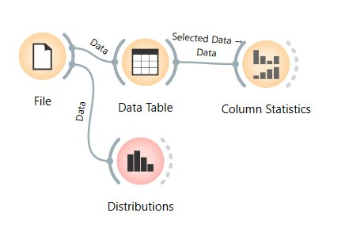

*Gambar 1: Workflow awal Orange — File dihubungkan ke Data Table, Column Statistics, dan Distributions*

---

### 3.3 Distribusi Data (Distributions)

**Langkah-langkah:**

1. Dari widget **File**, tarik koneksi ke widget **Distributions** (Visualize → Distributions)
2. Double-click Distributions untuk membuka jendela distribusi
3. Pada panel kiri, pilih variabel yang ingin dilihat distribusinya (misalnya variabel **1** = Student Age)
4. Histogram akan muncul secara otomatis di panel kanan

**Hasil Distribusi Variabel 1 (Student Age):**

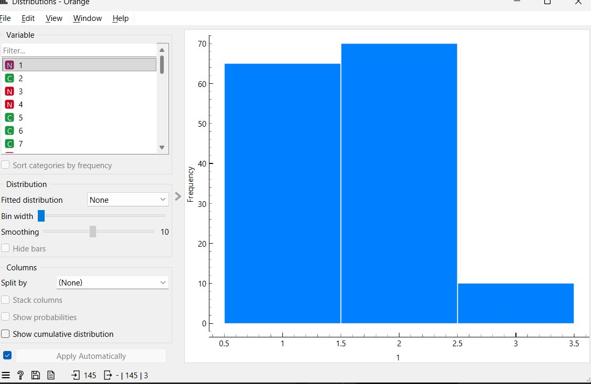

*Gambar 2: Distribusi usia mahasiswa — mayoritas berusia 22–25 tahun (nilai 2), diikuti 18–21 tahun (nilai 1), dan yang paling sedikit berusia >26 tahun (nilai 3)*

**Interpretasi:** Dataset ini didominasi oleh mahasiswa usia produktif 22–25 tahun (~70 mahasiswa), kemudian usia 18–21 (~65 mahasiswa), dan usia di atas 26 tahun hanya ~10 mahasiswa. Ini mencerminkan profil normal mahasiswa perguruan tinggi.

---

### 3.4 Scatter Plot

**Langkah-langkah:**

1. Dari widget **File**, tarik koneksi ke **Scatter Plot** (Visualize → Scatter Plot)
2. Double-click Scatter Plot untuk membukanya
3. **Scatter Plot Dasar:** Atur Axis X = variabel **1** (Age), Axis Y = variabel **2** (Sex) untuk melihat distribusi jenis kelamin berdasarkan usia

**Scatter Plot Awal (Age vs Sex):**

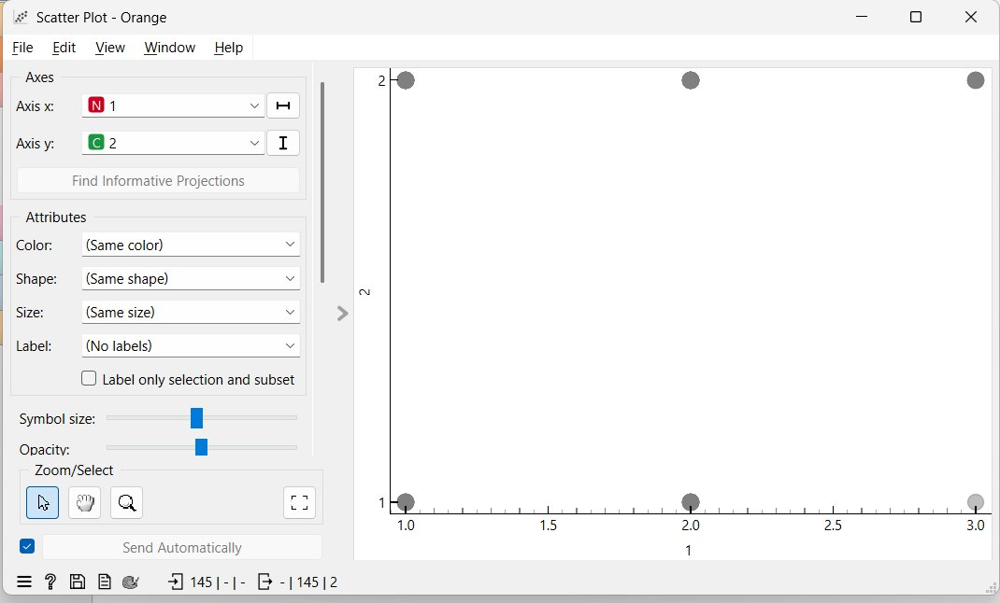

*Gambar 3: Scatter Plot variabel 1 (Age) vs variabel 2 (Sex) — pola grid menunjukkan kedua variabel bersifat kategorikal dengan nilai diskrit*

4. **Scatter Plot Informatif:** Ganti Axis X = **17** (Weekly Study Hours), Axis Y = **29** (Cumulative GPA), lalu pada bagian **Color** pilih **GRADE** untuk mewarnai titik berdasarkan nilai akhir

**Scatter Plot Weekly Study Hours vs Cumulative GPA (diwarnai GRADE):**

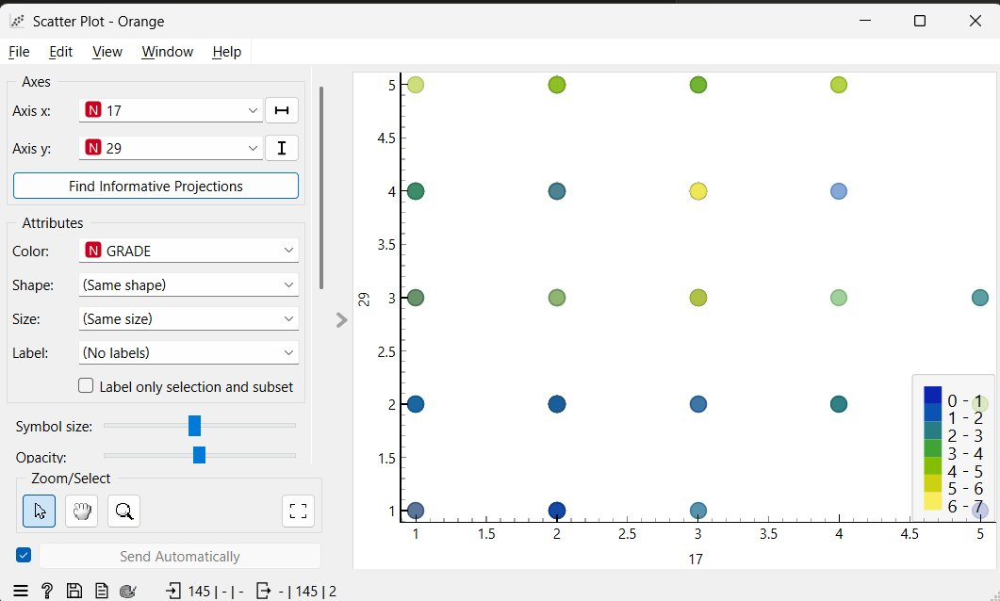

*Gambar 4: Scatter Plot jam belajar mingguan (sumbu X) vs IPK semester lalu (sumbu Y), diwarnai berdasarkan GRADE. Warna kuning-hijau (GRADE tinggi) cenderung berkumpul di area IPK tinggi (Y=4–5), sedangkan warna biru gelap (GRADE rendah) tersebar di semua area*

**Interpretasi:** Terdapat kecenderungan bahwa mahasiswa dengan IPK semester sebelumnya lebih tinggi (nilai 4–5) memiliki warna grade lebih tinggi (kuning). Namun, jam belajar saja tidak cukup menentukan grade secara linear.

**Workflow setelah Scatter Plot ditambahkan:**

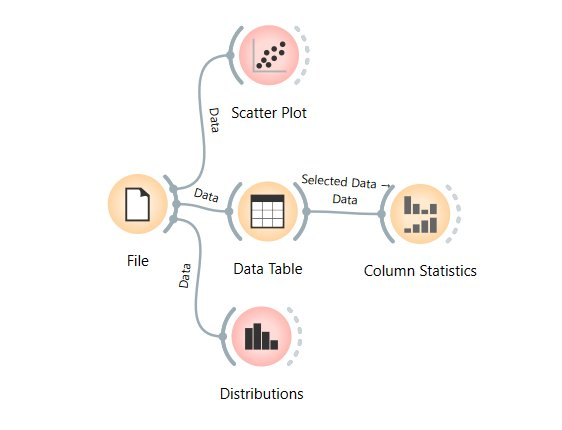

*Gambar 5: Workflow Orange dengan Scatter Plot ditambahkan ke pipeline*

---

### 3.5 Box Plot

**Langkah-langkah:**

1. Dari widget **File**, tarik koneksi ke **Box Plot** (Visualize → Box Plot)
2. Double-click Box Plot untuk membukanya
3. Pilih variabel yang ingin dianalisis pada panel **Variable** di kiri
4. Untuk melihat per kelompok, pilih variabel di panel **Subgroups**
5. Aktifkan **Compare means** pada bagian Display untuk melihat perbandingan

**Box Plot Variabel 1 (Student Age):**

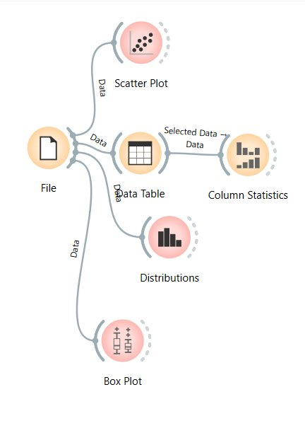

*Gambar 6: Box Plot variabel 1 (Student Age) — mean = 1.62 ± 0.6, median berada di antara nilai 1 dan 2. Whisker panjang ke kanan menunjukkan adanya outlier mahasiswa berusia lebih tua*

**Box Plot Variabel 29 (Cumulative GPA) tanpa Subgroup:**

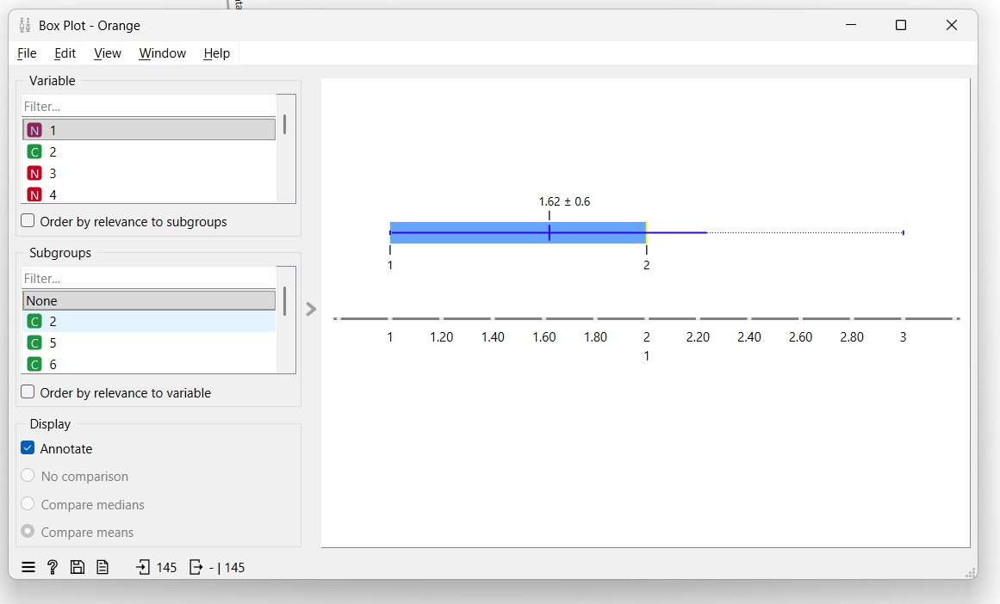

*Gambar 7: Box Plot variabel 29 (IPK semester lalu) — mean = 3.12 ± 1.3, menunjukkan distribusi yang cukup tersebar dengan rentang nilai 1–5. Median berada di nilai 3 (IPK 2.50–2.99)*

**Box Plot Variabel 29 dengan Subgroup Variabel 22 (Class Attendance) — Compare Means:**

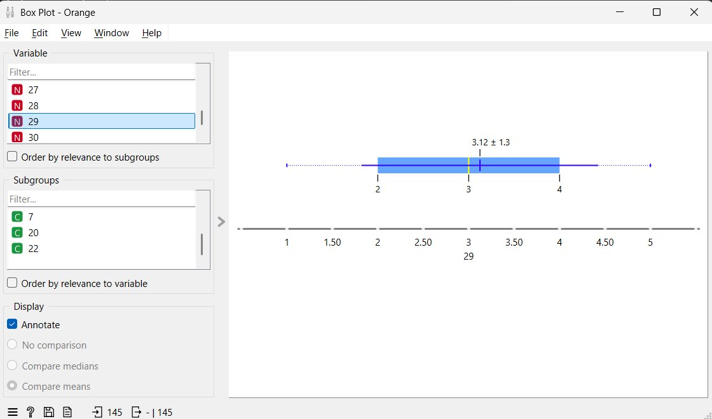

*Gambar 8: Box Plot IPK dibagi berdasarkan kehadiran kelas (variabel 22). Hasil uji Student's t = 2.323 (p=0.023, N=145) menunjukkan perbedaan signifikan. Mahasiswa yang selalu hadir (kelompok 1) memiliki rata-rata IPK lebih tinggi (3.25 ± 1.3) dibanding yang kadang-kadang hadir (kelompok 2) dengan rata-rata 2.71 ± 1.2*

**Interpretasi Penting:** Nilai **p=0.023 < 0.05** berarti kehadiran kelas berpengaruh signifikan secara statistik terhadap IPK. Ini adalah temuan penting: mahasiswa yang selalu hadir cenderung mendapatkan IPK lebih tinggi.

**Workflow dengan Box Plot:**

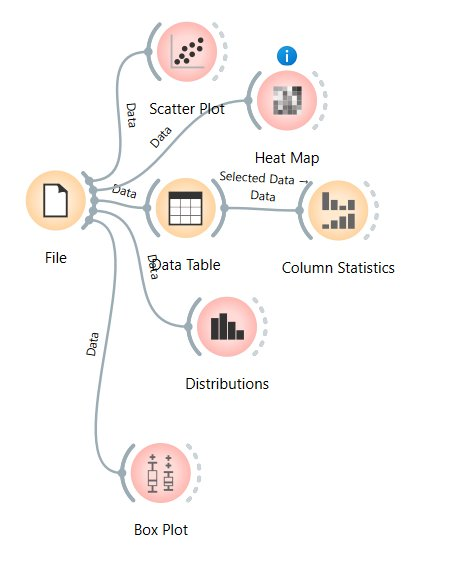

*Gambar 9: Workflow Orange dengan Box Plot ditambahkan*

---

### 3.6 Heat Map

**Langkah-langkah:**

1. Dari widget **Scatter Plot**, tarik koneksi ke **Heat Map** (Visualize → Heat Map), ATAU dari File langsung ke Heat Map
2. Double-click Heat Map
3. Pilih palette warna (disarankan **Blue-Green-Yellow**)
4. Atur Clustering Rows/Columns jika ingin mengelompokkan otomatis
5. Abaikan notifikasi tentang fitur kategorikal (fitur kategorikal memang diabaikan di Heat Map)

**Heat Map Semua Fitur Numerik:**

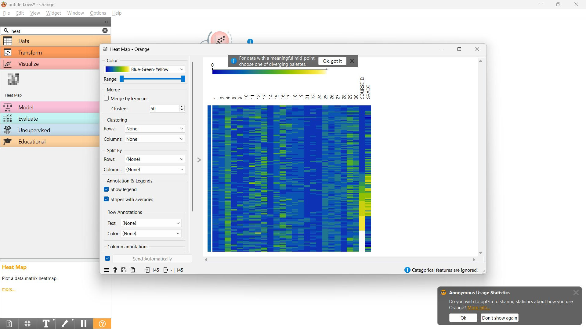

*Gambar 10: Heat Map semua fitur numerik dataset. Warna kuning menunjukkan nilai tinggi dan biru menunjukkan nilai rendah. Terlihat kolom GRADE dan variabel 29 (IPK) memiliki variasi warna yang mencolok. Catatan: fitur kategorikal diabaikan otomatis oleh Orange*

**Interpretasi:** Heat Map memperlihatkan pola sebaran nilai seluruh fitur sekaligus. Kolom yang dominan kuning di beberapa baris menunjukkan mahasiswa dengan performa dan kebiasaan belajar tinggi secara konsisten.

**Workflow dengan Heat Map:**

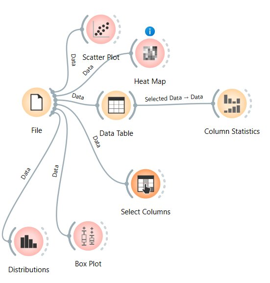

*Gambar 11: Workflow Orange setelah Heat Map ditambahkan dari Scatter Plot*

---

### 3.7 Preprocessing: Select Columns & Continuize

Sebelum melakukan pemodelan, data perlu dipersiapkan dengan benar.

#### A. Select Columns — Menentukan Fitur, Target, dan Meta

**Langkah-langkah:**

1. Dari widget **File**, tarik koneksi ke **Select Columns** (Data → Select Columns)
2. Double-click Select Columns
3. Pada panel **Metas**, biarkan **STUDENT ID** (tidak digunakan sebagai fitur)
4. **Tahap awal** — semua fitur masuk Features, Target masih kosong:

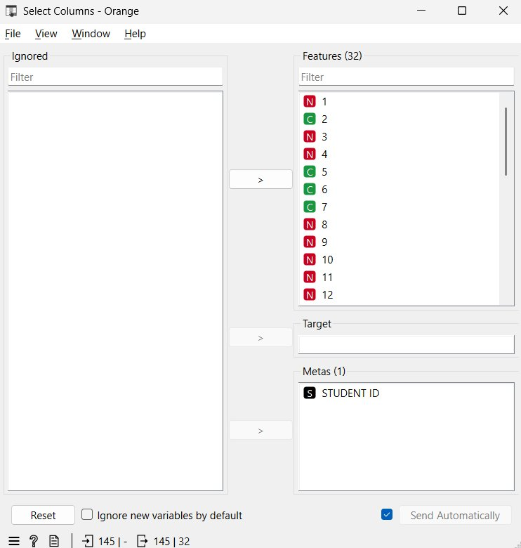

*Gambar 12: Tampilan awal Select Columns — 32 fitur aktif, STUDENT ID sebagai meta, Target belum diset*

5. Pindahkan **GRADE** dari Features ke kolom **Ignored** terlebih dahulu:

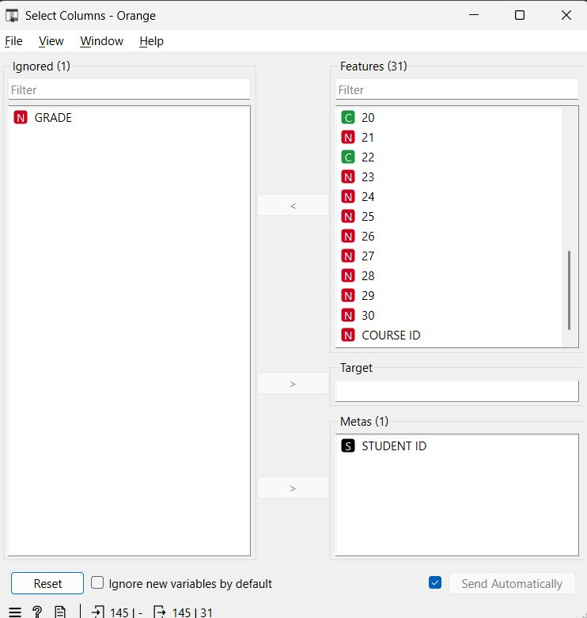

*Gambar 13: GRADE dipindah ke Ignored sementara untuk mempersiapkan assignment ke Target*

6. Lalu pindahkan **GRADE** ke kolom **Target**:

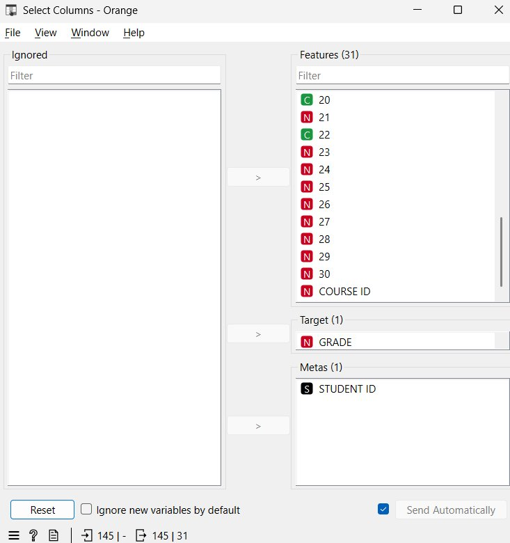

*Gambar 14: Konfigurasi final Select Columns — GRADE ditetapkan sebagai Target (variabel yang akan diprediksi), 31 fitur aktif, STUDENT ID sebagai meta*

#### B. Continuize — Mengubah Fitur Kategorikal

**Langkah-langkah:**

1. Dari **Select Columns**, tarik koneksi ke **Continuize** (Transform → Continuize)
2. Double-click Continuize
3. Pada **Categorical Variables**, pilih preset **First value as base** (mengubah kategorikal menjadi dummy/one-hot dengan nilai pertama sebagai baseline)
4. Pada **Numeric Variables**, biarkan **Keep as it is**

**Tampilan Continuize:**

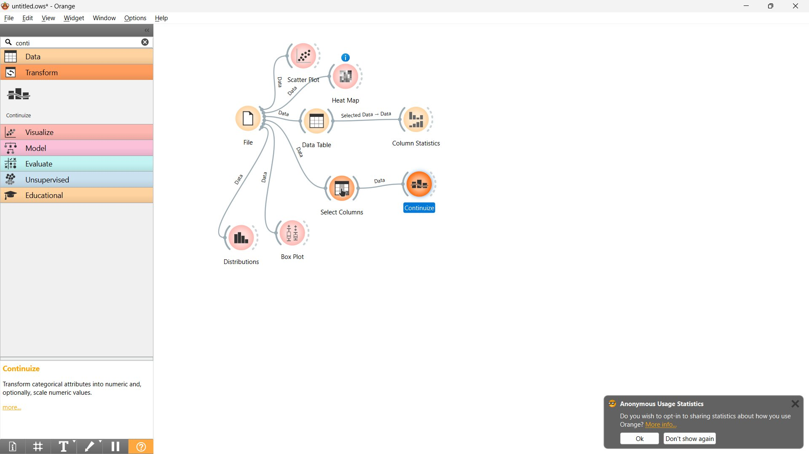

*Gambar 15: Workflow dengan Continuize ditambahkan setelah Select Columns*

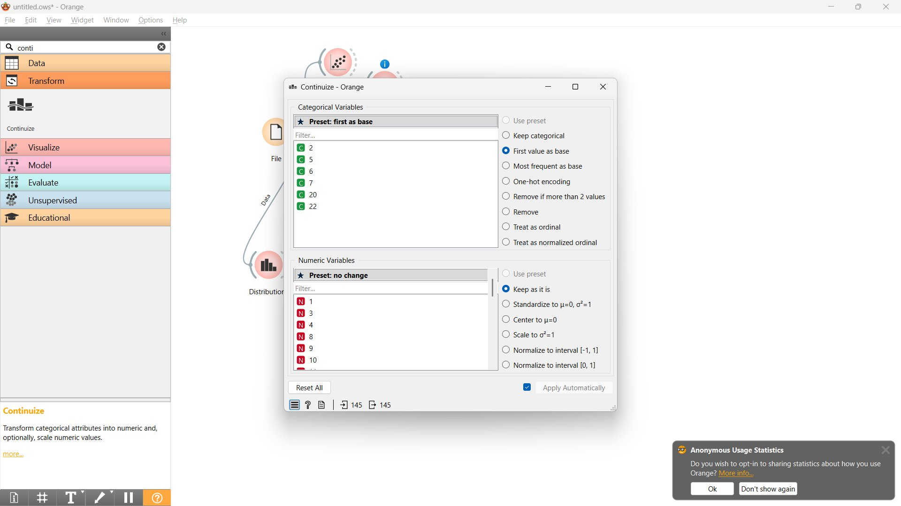

*Gambar 16: Pengaturan Continuize — Categorical Variables menggunakan "First value as base", Numeric Variables "Keep as it is". Fitur kategorikal yang diproses: 2 (Sex), 5 (Additional Work), 6 (Activity), 7 (Partner), 20 (Seminar), 22 (Attendance)*

---

### 3.8 Pemodelan & Evaluasi: Test and Score

#### A. Menambahkan Test and Score

**Langkah-langkah:**

1. Dari **Continuize**, tarik koneksi ke **Test and Score** (Evaluate → Test and Score)
2. Double-click Test and Score
3. Atur metode validasi: **Cross Validation**, Number of folds: **10**, centang **Stratified**

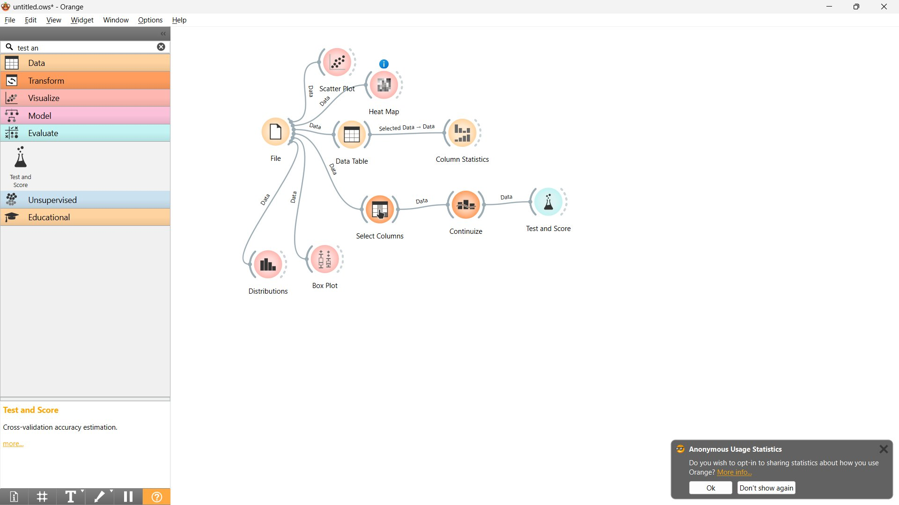

*Gambar 17: Workflow dengan Test and Score ditambahkan setelah Continuize*

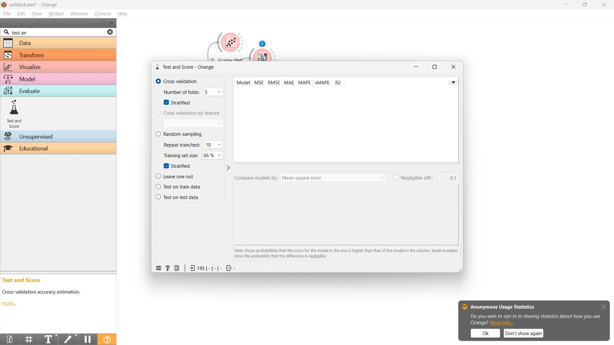

*Gambar 18: Pengaturan Test and Score — Cross Validation 5-fold (kemudian diubah ke 10-fold), metrik evaluasi yang dipilih: MSE, RMSE, MAE, MAPE, sMAPE, R²*

#### B. Menambahkan Model Decision Tree

**Langkah-langkah:**

1. Cari widget **Tree** di panel kiri (ketik "tree" di kolom pencarian → pilih **Tree** dari kategori Model)
2. Drag **Tree** ke canvas
3. Hubungkan **Tree → Test and Score** dengan koneksi **Learner**

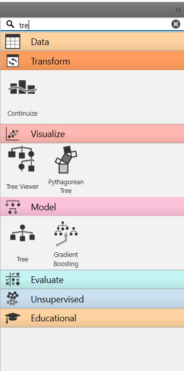

*Gambar 19: Mencari widget Tree di panel pencarian Orange*

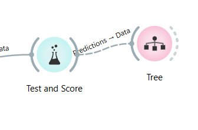

*Gambar 20: Tree dihubungkan ke Test and Score dengan koneksi Learner*

#### C. Menambahkan Model Naive Bayes, kNN, dan Random Forest

**Langkah-langkah:**

1. Tambahkan widget **Naive Bayes** (Model → Naive Bayes), hubungkan ke Test and Score
2. Tambahkan widget **kNN** (Model → kNN), hubungkan ke Test and Score
3. Tambahkan widget **Random Forest** (Model → Random Forest), hubungkan ke Test and Score

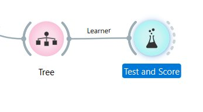

*Gambar 21: Empat model (Naive Bayes, Tree, kNN, Random Forest) semuanya terhubung ke Test and Score sebagai Learner*

**Workflow lengkap dengan semua model:**

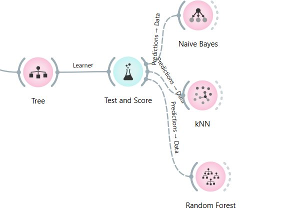

*Gambar 22: Workflow Orange lengkap — File → Scatter Plot, Heat Map, Column Statistics, Data Table, Distributions, Box Plot, Select Columns → Continuize → Tree → Test and Score, dengan Naive Bayes, kNN, dan Random Forest juga terhubung ke Test and Score*

#### D. Hasil Evaluasi Test and Score

**Persiapan — Metrik yang Dipilih:**

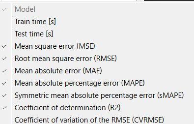

*Gambar 23: Daftar metrik yang diaktifkan untuk evaluasi: MSE, RMSE, MAE, MAPE, sMAPE, R², dan CVRMSE*

**Hasil Test and Score (Cross Validation 10-fold):**

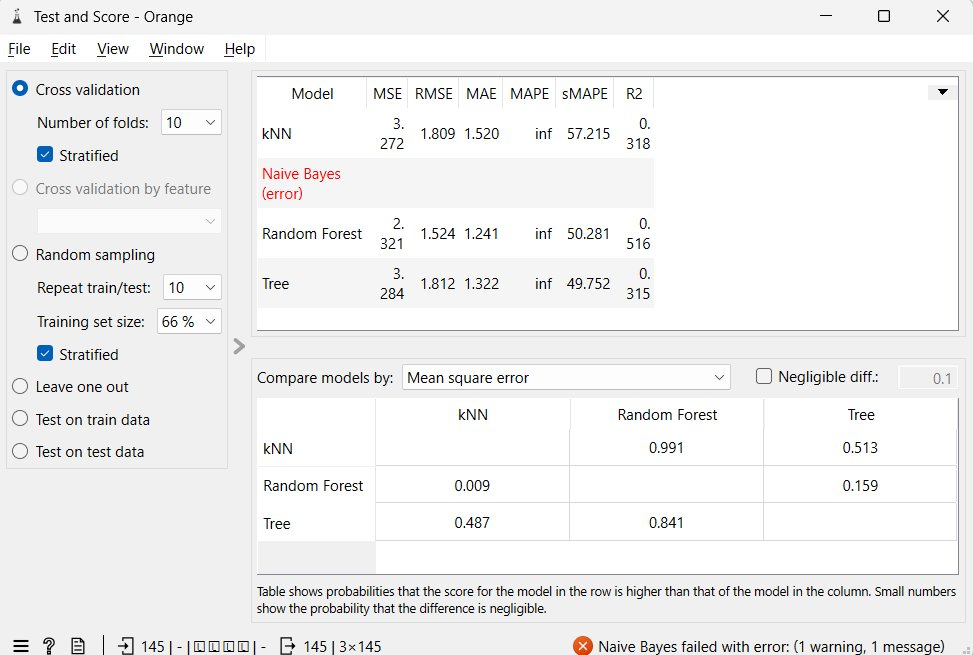

*Gambar 24: Hasil evaluasi 4 model dengan Cross Validation 10-fold*

| Model | MSE | RMSE | MAE | sMAPE | R² |
|---|---|---|---|---|---|
| **Random Forest** | **2.321** | **1.524** | **1.241** | 50.281 | **0.516** |
| kNN | 3.272 | 1.809 | 1.520 | 57.215 | 0.318 |
| Tree | 3.284 | 1.812 | 1.322 | 49.752 | 0.315 |
| Naive Bayes | — | — | — | — | — (Error) |

> **Naive Bayes gagal (error)** karena dataset ini memiliki target berupa nilai kontinu/ordinal (GRADE 0–7), sementara Naive Bayes di Orange membutuhkan target kategorikal murni.

**Tabel Perbandingan Probabilitas Antar Model (MSE):**

| | kNN | Random Forest | Tree |
|---|---|---|---|
| kNN | — | 0.991 | 0.513 |
| Random Forest | 0.009 | — | 0.159 |
| Tree | 0.487 | 0.841 | — |

Nilai kecil (misal Random Forest vs kNN = 0.009) berarti Random Forest **secara konsisten lebih baik** dari kNN. Nilai mendekati 0.5 berarti tidak ada perbedaan signifikan.

**Kesimpulan Evaluasi:** **Random Forest** adalah model terbaik dengan R² = 0.516 dan RMSE = 1.524, mengungguli semua model lainnya.

---

### 3.9 Visualisasi Pohon Keputusan (Tree Viewer)

**Langkah-langkah:**

1. Dari widget **Tree**, tarik koneksi ke **Tree Viewer** (Visualize → Tree Viewer)
2. Alternatif: dari **Test and Score**, tarik koneksi ke Tree Viewer
3. Double-click Tree Viewer untuk melihat struktur pohon keputusan

**Tree Viewer — Tampilan Atas:**

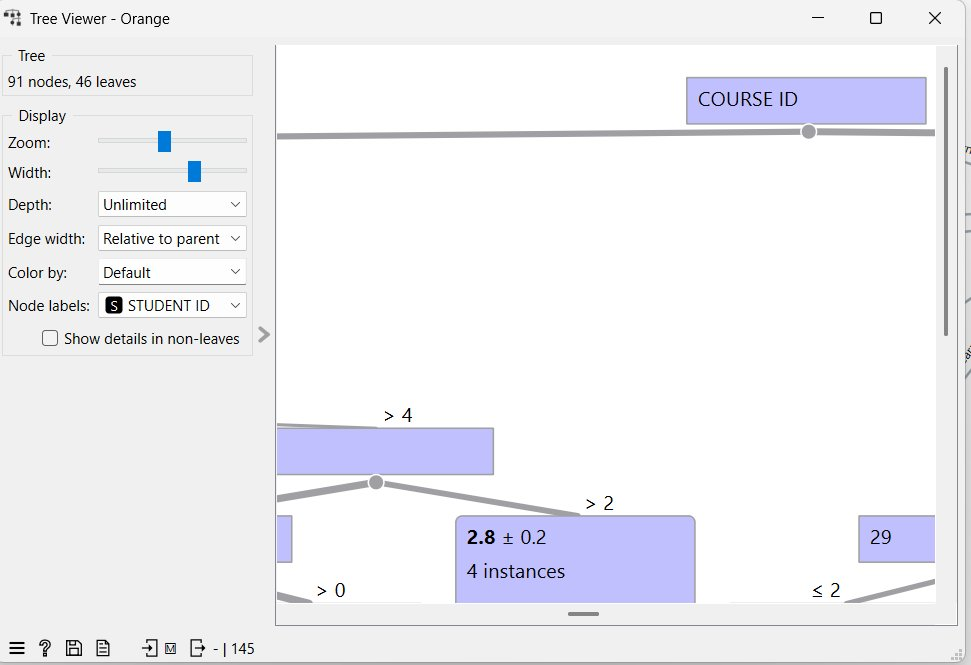

*Gambar 25: Struktur pohon keputusan — total 91 nodes, 46 leaves. Root node menggunakan **COURSE ID** sebagai pemisah pertama, menunjukkan bahwa jenis mata kuliah adalah faktor paling determinan dalam memprediksi nilai*

**Tree Viewer — Zoom In:**

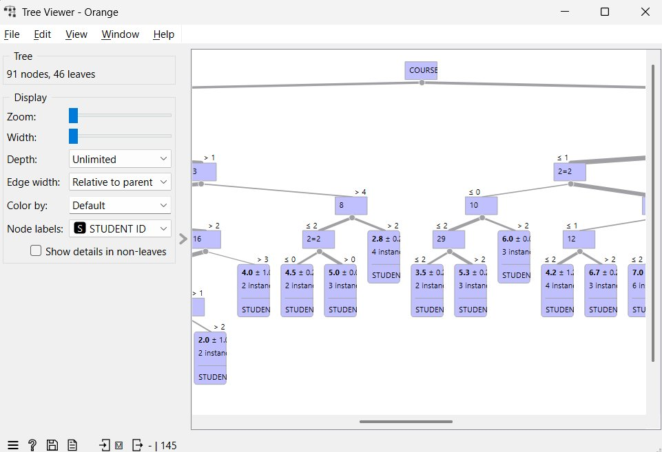

*Gambar 26: Detail cabang pohon keputusan. Setiap node leaf menampilkan nilai prediksi ± standar deviasi dan jumlah instance. Contoh: node dengan nilai "2.8 ± 0.2 (4 instances)" artinya 4 mahasiswa dengan karakteristik tersebut diprediksi mendapat GRADE sekitar 2.8 (antara DC dan CC)*

**Interpretasi Tree:** Pohon keputusan dimulai dari **COURSE ID** (pemisah utama), kemudian bercabang berdasarkan variabel lain seperti variabel **29** (IPK semester lalu). Pohon ini cukup dalam (91 node) yang menunjukkan model mampu menangkap pola kompleks, namun berpotensi overfitting.

---

### 3.10 Confusion Matrix

**Langkah-langkah:**

1. Dari **Test and Score**, tarik koneksi ke **Confusion Matrix** (Evaluate → Confusion Matrix)

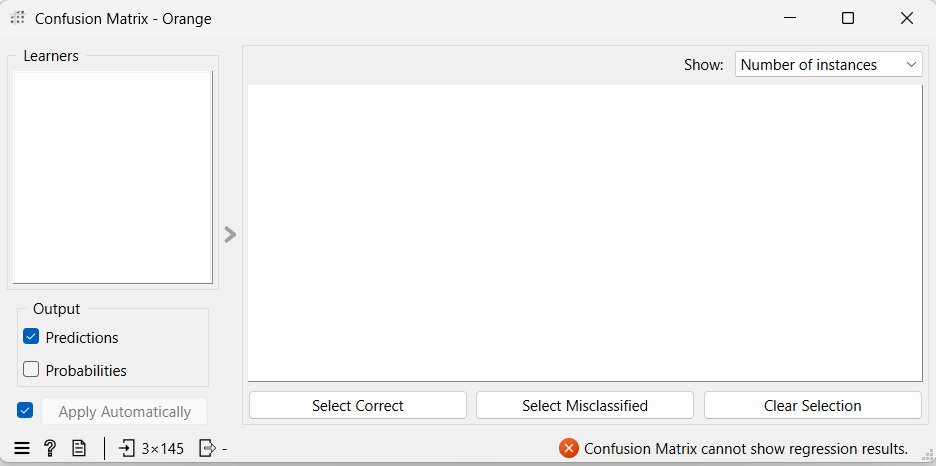

*Gambar 27: Confusion Matrix tidak dapat menampilkan hasil karena task ini adalah **regresi** (target GRADE bersifat numerik/ordinal 0–7), bukan klasifikasi biner. Orange menampilkan pesan "Confusion Matrix cannot show regression results"*

**Catatan Penting:** Confusion Matrix hanya bekerja untuk **klasifikasi** (target kategorikal). Karena GRADE diperlakukan sebagai nilai numerik kontinu di pipeline ini, Confusion Matrix tidak applicable. Untuk menggunakannya, GRADE perlu diubah menjadi tipe **Categorical** di Select Columns.

---

### 3.11 Workflow Akhir Orange

**Workflow Orange Lengkap:**


*Gambar 28: Workflow akhir Orange yang lengkap mencakup: (1) Visualisasi EDA — Scatter Plot, Heat Map, Column Statistics, Data Table, Distributions, Box Plot; (2) Preprocessing — Select Columns, Continuize; (3) Pemodelan — Tree, Naive Bayes, kNN, Random Forest ke Test and Score; (4) Evaluasi — Tree Viewer, Confusion Matrix*

---

## 4. Analisis di Google Colab (Python)

### 4.1 Install & Import Library

```python
# Install library yang diperlukan
!pip install ucimlrepo

# Import semua library
import pandas as pd
import numpy as np
import matplotlib.pyplot as plt
import seaborn as sns
from ucimlrepo import fetch_ucirepo

# Scikit-learn untuk pemodelan
from sklearn.model_selection import cross_val_score, KFold, StratifiedKFold
from sklearn.tree import DecisionTreeClassifier, DecisionTreeRegressor, plot_tree, export_text
from sklearn.ensemble import RandomForestClassifier, RandomForestRegressor
from sklearn.neighbors import KNeighborsClassifier, KNeighborsRegressor
from sklearn.naive_bayes import GaussianNB
from sklearn.preprocessing import LabelEncoder, StandardScaler
from sklearn.metrics import (classification_report, confusion_matrix,
                             mean_squared_error, mean_absolute_error, r2_score,
                             ConfusionMatrixDisplay, accuracy_score)

import warnings
warnings.filterwarnings('ignore')

# Setting tampilan
plt.rcParams['figure.figsize'] = (10, 6)
sns.set_theme(style='whitegrid')
print("Semua library berhasil diimport!")
```

---

### 4.2 Load Dataset

```python
# ====================================================
# CARA 1: Load langsung dari UCI Repository
# ====================================================
dataset = fetch_ucirepo(id=856)

X = dataset.data.features  # Fitur (31 kolom)
y = dataset.data.targets   # Target: GRADE

print("Metadata Dataset:")
print(dataset.metadata['name'])
print(f"\nJumlah Instance : {X.shape[0]}")
print(f"Jumlah Fitur    : {X.shape[1]}")
print(f"\nDistribusi GRADE:\n{y.value_counts().sort_index()}")

# Gabungkan untuk EDA
df = pd.concat([X, y], axis=1)
print(f"\nShape dataset gabungan: {df.shape}")
print(f"\nKolom: {df.columns.tolist()}")
```

```python
# ====================================================
# CARA 2: Load dari file CSV (jika sudah diunduh)
# ====================================================
# df = pd.read_csv('DATA (1).csv')
# X = df.drop(columns=['STUDENT ID', 'GRADE'])
# y = df['GRADE']
```

---

### 4.3 Eksplorasi Data (EDA)

```python
# --------------------------------------------------
# A. Informasi Dasar Dataset
# --------------------------------------------------
print("=== INFO DATASET ===")
print(df.info())

print("\n=== STATISTIK DESKRIPTIF ===")
print(df.describe().round(2))

print("\n=== MISSING VALUES ===")
print(df.isnull().sum())
print(f"\nTotal missing: {df.isnull().sum().sum()}")
# Output: Total missing: 0 (tidak ada missing values)
```

```python
# --------------------------------------------------
# B. Distribusi Target (GRADE)
# --------------------------------------------------
fig, axes = plt.subplots(1, 2, figsize=(14, 5))

grade_labels = {0:'Fail', 1:'DD', 2:'DC', 3:'CC', 4:'CB', 5:'BB', 6:'BA', 7:'AA'}

# Bar chart distribusi
grade_counts = y.iloc[:, 0].value_counts().sort_index()
axes[0].bar(grade_counts.index, grade_counts.values,
            color=sns.color_palette('viridis', len(grade_counts)))
axes[0].set_xlabel('GRADE (0=Fail ... 7=AA)')
axes[0].set_ylabel('Jumlah Mahasiswa')
axes[0].set_title('Distribusi GRADE Mahasiswa')
axes[0].set_xticks(grade_counts.index)
axes[0].set_xticklabels([grade_labels[i] for i in grade_counts.index], rotation=45)

# Pie chart
axes[1].pie(grade_counts.values,
            labels=[grade_labels[i] for i in grade_counts.index],
            autopct='%1.1f%%',
            colors=sns.color_palette('viridis', len(grade_counts)))
axes[1].set_title('Proporsi GRADE (%)')

plt.suptitle('Distribusi Nilai Akhir (GRADE) Mahasiswa', fontsize=14, fontweight='bold')
plt.tight_layout()
plt.savefig('distribusi_grade.png', dpi=150, bbox_inches='tight')
plt.show()
```

```python
# --------------------------------------------------
# C. Distribusi Fitur Utama
# --------------------------------------------------
# Mapping nama variabel
var_names = {
    1: 'Student Age', 2: 'Sex', 3: 'HS Type', 4: 'Scholarship',
    5: 'Add. Work', 6: 'Activity', 7: 'Partner', 8: 'Salary',
    9: 'Transport', 10: 'Accommodation', 17: 'Study Hours/Week',
    22: 'Class Attendance', 29: 'Cumulative GPA'
}

fig, axes = plt.subplots(3, 4, figsize=(18, 12))
axes = axes.flatten()

selected_vars = [1, 2, 3, 4, 5, 6, 7, 17, 22, 24, 29, 30]

for idx, var in enumerate(selected_vars):
    col_name = str(var)
    if col_name in df.columns:
        df[col_name].value_counts().sort_index().plot(
            kind='bar', ax=axes[idx], color='steelblue', edgecolor='white')
        label = var_names.get(var, f'Var {var}')
        axes[idx].set_title(f'Variabel {var}: {label}', fontsize=10)
        axes[idx].set_xlabel('')
        axes[idx].tick_params(axis='x', rotation=0)

plt.suptitle('Distribusi Fitur-Fitur Utama', fontsize=14, fontweight='bold')
plt.tight_layout()
plt.savefig('distribusi_fitur.png', dpi=150, bbox_inches='tight')
plt.show()
```

```python
# --------------------------------------------------
# D. Heatmap Korelasi
# --------------------------------------------------
# Pilih fitur numerik saja
numeric_cols = df.select_dtypes(include=[np.number]).columns.tolist()

plt.figure(figsize=(18, 14))
corr_matrix = df[numeric_cols].corr()

mask = np.triu(np.ones_like(corr_matrix, dtype=bool))
sns.heatmap(corr_matrix,
            mask=mask,
            annot=False,
            cmap='RdYlBu_r',
            center=0,
            vmin=-1, vmax=1,
            square=True,
            linewidths=0.5,
            cbar_kws={"shrink": 0.8})

plt.title('Heatmap Korelasi Antar Variabel', fontsize=14, fontweight='bold')
plt.tight_layout()
plt.savefig('heatmap_korelasi.png', dpi=150, bbox_inches='tight')
plt.show()

# Top 10 fitur paling berkorelasi dengan GRADE
print("\n=== TOP 10 KORELASI DENGAN GRADE ===")
grade_corr = corr_matrix['GRADE'].abs().sort_values(ascending=False)
print(grade_corr.head(11))
```

```python
# --------------------------------------------------
# E. Box Plot: IPK vs Kehadiran Kelas
# --------------------------------------------------
fig, axes = plt.subplots(1, 2, figsize=(14, 6))

attendance_labels = {1: 'Selalu', 2: 'Kadang', 3: 'Tidak Pernah'}

# Box plot GPA per kategori kehadiran
gpa_by_attend = [df[df['22'] == i]['29'].values for i in [1, 2, 3]]
bp = axes[0].boxplot(gpa_by_attend, patch_artist=True,
                     medianprops=dict(color='gold', linewidth=2))
colors = ['#2196F3', '#FF9800', '#F44336']
for patch, color in zip(bp['boxes'], colors):
    patch.set_facecolor(color)
    patch.set_alpha(0.7)
axes[0].set_xticks([1, 2, 3])
axes[0].set_xticklabels(['Selalu', 'Kadang', 'Tidak Pernah'])
axes[0].set_xlabel('Kehadiran Kelas (Var 22)')
axes[0].set_ylabel('IPK Semester Lalu (Var 29)')
axes[0].set_title('IPK vs Kehadiran Kelas')

# Box plot GRADE per jam belajar
study_groups = [df[df['17'] == i]['GRADE'].values for i in range(1, 6)]
bp2 = axes[1].boxplot(study_groups, patch_artist=True,
                      medianprops=dict(color='gold', linewidth=2))
palette2 = sns.color_palette('Blues', 5)
for patch, color in zip(bp2['boxes'], palette2):
    patch.set_facecolor(color)
    patch.set_alpha(0.9)
axes[1].set_xticks(range(1, 6))
axes[1].set_xticklabels(['Tidak Ada', '<5 Jam', '6-10 Jam', '11-20 Jam', '>20 Jam'], rotation=15)
axes[1].set_xlabel('Jam Belajar Mingguan (Var 17)')
axes[1].set_ylabel('GRADE')
axes[1].set_title('GRADE vs Jam Belajar Mingguan')

plt.suptitle('Analisis Box Plot Faktor Akademik', fontsize=13, fontweight='bold')
plt.tight_layout()
plt.savefig('boxplot_analisis.png', dpi=150, bbox_inches='tight')
plt.show()
```

```python
# --------------------------------------------------
# F. Scatter Plot: Study Hours vs GPA
# --------------------------------------------------
plt.figure(figsize=(10, 7))

scatter = plt.scatter(df['17'], df['29'],
                      c=df['GRADE'],
                      cmap='viridis',
                      s=80, alpha=0.8, edgecolors='white', linewidth=0.5)

plt.colorbar(scatter, label='GRADE (0=Fail, 7=AA)')
plt.xlabel('Jam Belajar Mingguan (1=Tidak Ada ... 5=>20 Jam)', fontsize=12)
plt.ylabel('IPK Semester Lalu (1=<2.00 ... 5=>3.49)', fontsize=12)
plt.title('Scatter Plot: Jam Belajar vs IPK\n(Diwarnai berdasarkan GRADE)', fontsize=13, fontweight='bold')
plt.grid(True, alpha=0.3)
plt.tight_layout()
plt.savefig('scatter_study_gpa.png', dpi=150, bbox_inches='tight')
plt.show()
```

---

### 4.4 Preprocessing

```python
# --------------------------------------------------
# A. Persiapan Fitur dan Target
# --------------------------------------------------
from sklearn.preprocessing import LabelEncoder

# Ambil fitur dan target
feature_cols = [str(i) for i in range(1, 31)] + ['COURSE ID']
X_clean = df[feature_cols].copy()
y_clean = df['GRADE'].copy()

print(f"Shape X: {X_clean.shape}")
print(f"Shape y: {y_clean.shape}")
print(f"Distribusi GRADE:\n{y_clean.value_counts().sort_index()}")
```

```python
# --------------------------------------------------
# B. Encode Fitur Kategorikal
# --------------------------------------------------
# Fitur kategorikal (C di Orange): 2, 5, 6, 7, 20, 22
categorical_features = ['2', '5', '6', '7', '20', '22']

X_encoded = X_clean.copy()

# One-hot encoding untuk fitur kategorikal
X_encoded = pd.get_dummies(X_encoded, columns=categorical_features,
                            prefix=categorical_features, drop_first=True)

print(f"Shape setelah encoding: {X_encoded.shape}")
print(f"Kolom baru: {X_encoded.columns.tolist()[:10]}...")
```

```python
# --------------------------------------------------
# C. Normalisasi (opsional, untuk kNN)
# --------------------------------------------------
from sklearn.preprocessing import StandardScaler

scaler = StandardScaler()
X_scaled = scaler.fit_transform(X_encoded)
X_scaled_df = pd.DataFrame(X_scaled, columns=X_encoded.columns)

print("Preprocessing selesai!")
print(f"Shape akhir X: {X_scaled_df.shape}")
```

---

### 4.5 Pemodelan Klasifikasi

```python
# --------------------------------------------------
# Persiapan: Ubah GRADE ke Klasifikasi
# --------------------------------------------------
# Untuk klasifikasi, pastikan y adalah integer
y_clf = y_clean.astype(int)

# Definisikan semua model
models = {
    'Decision Tree'  : DecisionTreeClassifier(random_state=42, max_depth=10),
    'Random Forest'  : RandomForestClassifier(random_state=42, n_estimators=100),
    'kNN'            : KNeighborsClassifier(n_neighbors=5),
    'Naive Bayes'    : GaussianNB()
}

# Cross Validation 10-fold
kf = StratifiedKFold(n_splits=10, shuffle=True, random_state=42)

print("=" * 60)
print(f"{'Model':<20} {'Accuracy':<12} {'Std Dev':<12}")
print("=" * 60)

results = {}
for name, model in models.items():
    scores = cross_val_score(model, X_encoded, y_clf, cv=kf, scoring='accuracy')
    results[name] = scores
    print(f"{name:<20} {scores.mean():.4f}       ± {scores.std():.4f}")

print("=" * 60)
```

---

### 4.6 Evaluasi Model

```python
# --------------------------------------------------
# A. Training dan Evaluasi Lengkap (Train-Test Split)
# --------------------------------------------------
from sklearn.model_selection import train_test_split

X_train, X_test, y_train, y_test = train_test_split(
    X_encoded, y_clf, test_size=0.2, random_state=42, stratify=y_clf)

print(f"Train size: {X_train.shape[0]}, Test size: {X_test.shape[0]}")
```

```python
# --------------------------------------------------
# B. Evaluasi Setiap Model
# --------------------------------------------------
evaluation_results = {}

for name, model in models.items():
    model.fit(X_train, y_train)
    y_pred = model.predict(X_test)

    acc   = accuracy_score(y_test, y_pred)
    mse   = mean_squared_error(y_test, y_pred)
    rmse  = np.sqrt(mse)
    mae   = mean_absolute_error(y_test, y_pred)
    r2    = r2_score(y_test, y_pred)

    evaluation_results[name] = {
        'Accuracy': acc, 'MSE': mse, 'RMSE': rmse, 'MAE': mae, 'R2': r2
    }

    print(f"\n{'='*50}")
    print(f"MODEL: {name}")
    print(f"  Accuracy : {acc:.4f} ({acc*100:.2f}%)")
    print(f"  MSE      : {mse:.4f}")
    print(f"  RMSE     : {rmse:.4f}")
    print(f"  MAE      : {mae:.4f}")
    print(f"  R²       : {r2:.4f}")
    print(f"\nClassification Report:")
    print(classification_report(y_test, y_pred,
          target_names=[f'Grade {i}' for i in range(8)], zero_division=0))
```

```python
# --------------------------------------------------
# C. Visualisasi Perbandingan Model
# --------------------------------------------------
metrics_df = pd.DataFrame(evaluation_results).T

fig, axes = plt.subplots(2, 2, figsize=(14, 10))
metrics = ['Accuracy', 'RMSE', 'MAE', 'R2']
colors_bar = ['#2196F3', '#4CAF50', '#FF9800', '#9C27B0']

for idx, metric in enumerate(metrics):
    ax = axes[idx // 2][idx % 2]
    bars = ax.bar(metrics_df.index, metrics_df[metric],
                  color=colors_bar, edgecolor='white', alpha=0.85)
    ax.set_title(f'Perbandingan {metric}', fontweight='bold')
    ax.set_ylabel(metric)
    ax.tick_params(axis='x', rotation=15)

    # Tambahkan nilai di atas bar
    for bar in bars:
        height = bar.get_height()
        ax.annotate(f'{height:.3f}',
                    xy=(bar.get_x() + bar.get_width() / 2, height),
                    xytext=(0, 3), textcoords="offset points",
                    ha='center', va='bottom', fontsize=10)

plt.suptitle('Perbandingan Metrik Evaluasi Antar Model', fontsize=14, fontweight='bold')
plt.tight_layout()
plt.savefig('perbandingan_model.png', dpi=150, bbox_inches='tight')
plt.show()
```

```python
# --------------------------------------------------
# D. Confusion Matrix — Random Forest (model terbaik)
# --------------------------------------------------
rf_model = RandomForestClassifier(random_state=42, n_estimators=100)
rf_model.fit(X_train, y_train)
y_pred_rf = rf_model.predict(X_test)

grade_labels_list = ['Fail', 'DD', 'DC', 'CC', 'CB', 'BB', 'BA', 'AA']
cm = confusion_matrix(y_test, y_pred_rf)

plt.figure(figsize=(10, 8))
sns.heatmap(cm, annot=True, fmt='d', cmap='Blues',
            xticklabels=grade_labels_list[:len(cm)],
            yticklabels=grade_labels_list[:len(cm)])
plt.xlabel('Prediksi', fontsize=12)
plt.ylabel('Aktual', fontsize=12)
plt.title('Confusion Matrix — Random Forest\n(Model Terbaik)', fontsize=13, fontweight='bold')
plt.tight_layout()
plt.savefig('confusion_matrix_rf.png', dpi=150, bbox_inches='tight')
plt.show()

print(f"Accuracy Random Forest: {accuracy_score(y_test, y_pred_rf):.4f}")
```

```python
# --------------------------------------------------
# E. Feature Importance — Random Forest
# --------------------------------------------------
feat_importance = pd.Series(rf_model.feature_importances_,
                            index=X_encoded.columns).sort_values(ascending=False)

plt.figure(figsize=(12, 7))
feat_importance.head(15).plot(kind='bar', color='steelblue', edgecolor='white', alpha=0.85)
plt.title('Top 15 Fitur Paling Penting — Random Forest', fontsize=13, fontweight='bold')
plt.xlabel('Fitur')
plt.ylabel('Feature Importance Score')
plt.xticks(rotation=45, ha='right')
plt.tight_layout()
plt.savefig('feature_importance.png', dpi=150, bbox_inches='tight')
plt.show()

print("\nTop 10 Fitur Terpenting:")
print(feat_importance.head(10))
```

---

### 4.7 Visualisasi Pohon Keputusan

```python
# --------------------------------------------------
# Visualisasi Decision Tree (max_depth=4 agar terbaca)
# --------------------------------------------------
dt_model = DecisionTreeClassifier(random_state=42, max_depth=4)
dt_model.fit(X_train, y_train)

plt.figure(figsize=(24, 10))
plot_tree(dt_model,
          feature_names=X_encoded.columns,
          class_names=[str(i) for i in range(8)],
          filled=True,
          rounded=True,
          fontsize=8,
          max_depth=4)
plt.title('Visualisasi Decision Tree (Depth=4)', fontsize=14, fontweight='bold')
plt.tight_layout()
plt.savefig('decision_tree.png', dpi=120, bbox_inches='tight')
plt.show()

# Tampilkan aturan pohon dalam teks
tree_rules = export_text(dt_model,
                         feature_names=list(X_encoded.columns),
                         max_depth=3)
print("=== ATURAN DECISION TREE (3 Level Pertama) ===")
print(tree_rules)
```

---

## 5. Perbandingan Hasil Model

### Hasil di Orange (Regression — Cross Validation 10-Fold)

| Model | MSE | RMSE | MAE | sMAPE | R² | Keterangan |
|---|---|---|---|---|---|---|
| **Random Forest** | **2.321** | **1.524** | **1.241** | 50.281 | **0.516** | Terbaik |
| kNN | 3.272 | 1.809 | 1.520 | 57.215 | 0.318 | Cukup |
| Tree (Decision Tree) | 3.284 | 1.812 | 1.322 | 49.752 | 0.315 | Cukup |
| Naive Bayes | — | — | — | — | — | Error (regression) |

### Analisis Perbandingan Probabilitas Model (Orange)

| | kNN | Random Forest | Tree |
|---|---|---|---|
| kNN | — | 0.991 | 0.513 |
| Random Forest | **0.009** | — | 0.159 |
| Tree | 0.487 | 0.841 | — |

Nilai **Random Forest vs kNN = 0.009** berarti ada probabilitas hanya 0.9% bahwa kNN lebih baik dari Random Forest. Ini **konfirmasi kuat** bahwa Random Forest adalah model yang unggul.

### Insight Utama dari Analisis

1. **COURSE ID** adalah fitur paling penting (root node Decision Tree), menunjukkan bahwa jenis mata kuliah sangat mempengaruhi nilai akhir.

2. **IPK semester sebelumnya (Var 29)** berkorelasi kuat dengan performa akhir — mahasiswa dengan IPK tinggi cenderung mempertahankan performanya.

3. **Kehadiran kelas (Var 22)** terbukti signifikan secara statistik (p=0.023) terhadap IPK. Mahasiswa yang selalu hadir rata-rata IPK lebih tinggi (3.25 vs 2.71).

4. **Random Forest** unggul karena kemampuannya menangani banyak fitur dengan interaksi kompleks tanpa overfitting berlebih seperti single Decision Tree.

5. **Naive Bayes** tidak applicable untuk task regresi/ordinal ini di Orange. Di Python, GaussianNB dapat digunakan namun performa biasanya lebih rendah pada data yang bukan memenuhi asumsi Gaussian.

---

## 6. Kesimpulan

Berdasarkan analisis lengkap menggunakan Orange Data Mining dan Google Colab:

1. **Dataset** terdiri dari 145 mahasiswa dengan 31 fitur yang mencakup aspek personal, keluarga, dan kebiasaan belajar. Tidak ada missing values sehingga tidak diperlukan imputasi.

2. **Eksplorasi Data (EDA)** mengungkap bahwa:
   - Mayoritas mahasiswa berusia 22–25 tahun
   - IPK rata-rata semester lalu adalah 3.12 ± 1.3
   - Kehadiran kelas berpengaruh signifikan terhadap IPK (p=0.023)
   - Mahasiswa dengan jam belajar lebih banyak dan IPK sebelumnya lebih tinggi cenderung mendapat GRADE lebih baik

3. **Preprocessing** yang dilakukan: penetapan GRADE sebagai target, STUDENT ID sebagai meta, dan Continuize untuk fitur kategorikal.

4. **Evaluasi Model** dengan Cross Validation 10-fold menunjukkan **Random Forest** sebagai model terbaik (R²=0.516, RMSE=1.524), diikuti kNN (R²=0.318) dan Decision Tree (R²=0.315). Naive Bayes tidak dapat digunakan karena ketidaksesuaian tipe data target.

5. **Rekomendasi:** Untuk meningkatkan performa model, dapat dilakukan hyperparameter tuning pada Random Forest, feature selection yang lebih selektif, atau mencoba model lain seperti Gradient Boosting / XGBoost.

---

## 7. Referensi

- Yilmaz, N. & Şekeroğlu, B. (2019). *Higher Education Students Performance Evaluation* [Dataset]. UCI Machine Learning Repository. https://doi.org/10.24432/C51G82
- Yilmaz, N., & Şekeroğlu, B. (2019). *Student Performance Classification Using Artificial Intelligence Techniques*. Advances in Intelligent Systems and Computing, vol 1095.
- Orange Data Mining: https://orangedatamining.com
- UCI Machine Learning Repository: https://archive.ics.uci.edu/dataset/856/higher+education+students+performance+evaluation
- Scikit-learn Documentation: https://scikit-learn.org/stable/

---

*Laporan ini dibuat untuk keperluan UAS Mata Kuliah Penambangan Data — Teknik Informatika Semester 4*
